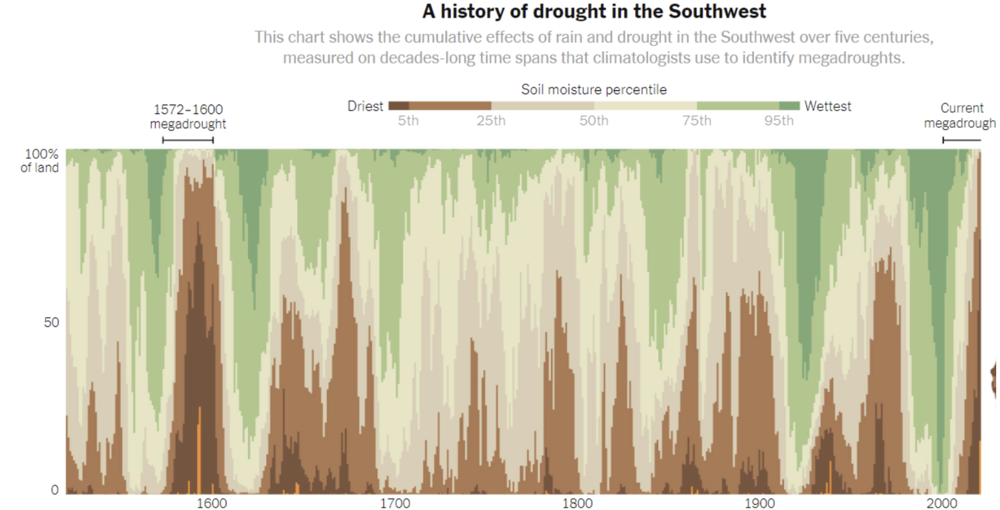

```{r}
#| include: false
#| warning: false
#| message: false
# Some global options still not available in quarto
 knitr::opts_chunk$set(fig.align = 'center')
library(knitr)
library(tidyverse)
library(moderndive)
theme_update(text = element_text(size = 20))
```


::::: columns
::: {.column .center width="45%"}
{width="90%"}
:::

::: {.column .center width="55%"}
[Final Exam Review Trivia]{.custom-title}

<br> <br> <br>

[Kelly McConville]{.custom-subtitle}

[DATA 100 <br> Week 14 \| Spring 2026]{.custom-subtitle}
:::
:::::

------------------------------------------------------------------------

## Plan

-  Hex cookie decorating

-  Talk through upcoming exam
    -  Go to the Final Exam Guidance and Practice on Posit Cloud.

-  Trivia challenge
    -  1 point for each correct answer
    -  Categories: Data Wrangling, Data Visualization, Modeling, Miscellaneous
    - Prizes!

# Hex Cookies!

#  Final Exam Guidance and Practice

#  Data Wrangling

# Question 1: What is the R syntax for “not equal”?

---

## Question 2: How many columns and how many rows will the wrangled data have?


```{r}
#| echo: false
set.seed(556)
library(palmerpenguins)
penguins_small <- select(penguins, species, island, body_mass_g, bill_length_mm) %>%
  sample_n(size = 8)
penguins_small
```

```{r}
#| eval: false
count(penguins_small, species, island)
```


# Question 3: What’s a good dplyr function for sorting the rows of your dataset? 

# Question 4: What function should I use if I want to join two datasets and only keep rows that have a match for the key variable in both datasets? 

---

## Question 5: How many columns and how many rows will the wrangled data have? 

```{r}
#| echo: false
penguins_small
```

```{r}
#| eval: false
penguins_small %>%
  group_by(species) %>%
  summarize(thing1 = mean(body_mass_g), thing2 = IQR(body_mass_g))
```

# Question 6: Name a data wrangling function where the function name has only 1 character.


# Data Visualization

# Question 1: For each of the following three geoms, do we use “fill” or “color” if we want to color in (not just outline) a geom by the values of a variable: geom_point, geom_violin, geom_bar?

# Question 2: Name two ways to address overplotting in a ggplot2 scatterplot.

# Question 3: Identify the color palette type used in this graph.



# Question 4: If I want to add a title to my ggplot, what layer do I need to add? 

# Question 5: What argument goes into geom_bar to convert the bars from raw counts to conditional proportions?

# Question 6: When graphing a categorical variable with two categories, what colors does ggplot2 use by default? 


# Modeling

---

## Question 1: Supppose I want to build a linear regression model for the body mass of a penguin.  I plan to use species (Adelie, Gentoo, and Chinstrap) and bill length in my model with no interaction terms.  When I run get_regression_table() on my model, how many rows will the output table have?

```{r}
#| echo: false
penguins <- penguins %>%
  drop_na()
penguins

```


# Question 2: Holding all else constant, which will be wider: a prediction interval for a new observation or a confidence interval for the mean? 

# Question 3: When will a residual be equal to zero?

# Question 4: What plot should we produce to check that the errors of our regression model are normally distributed?

---

## Question 5: Interpret the coefficient associated with `species: Chinstrap`.  (Recall the species are Adelie, Chinstrap, and Gentoo.)

```{r}
mod <- lm(body_mass_g ~ species + bill_length_mm, data = penguins)
get_regression_table(mod)
```

---

## Question 6: Interpret the coefficient associated with `bill_length_mm`.  

```{r}
mod <- lm(body_mass_g ~ species + bill_length_mm, data = penguins)
get_regression_table(mod)
```

# Miscellaneous

# Question 1: Did you decorate a hex cookie?  (2 points per cookie for up to 4 points max)

# Question 2: Which of the following colors are valid built-in R colors:  fuchsia, gray93, burlywood, lavenderblush? 

# Question 3: How many color names are built into R?  Your guess must be within 20 of the true number. 

# Question 4: Suppose I grouped my population into 5 distinct groups and I took a random sample within each.  What sampling method did I employ?

# Question 5: What probability does a p-value represent? 

# Question 6: Name your favorite R function.
