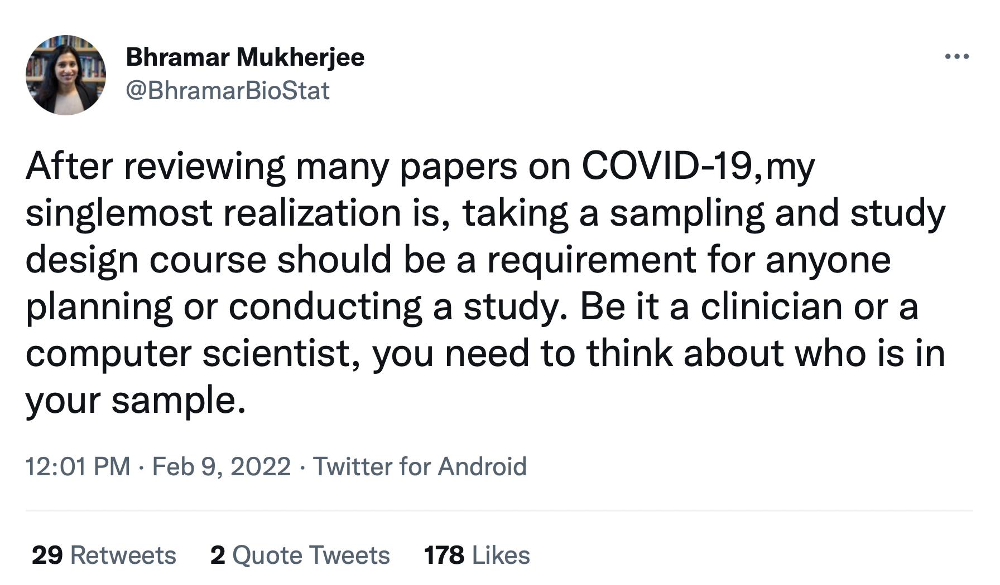
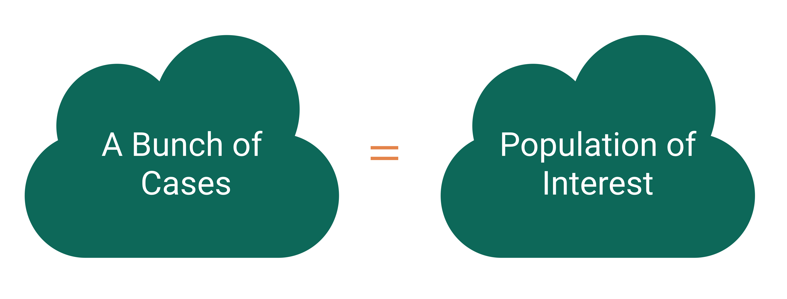
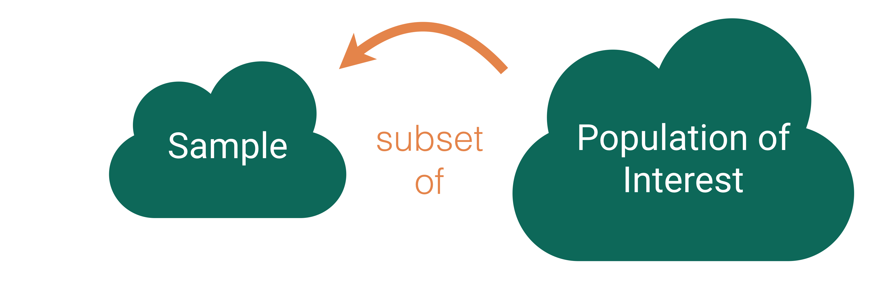
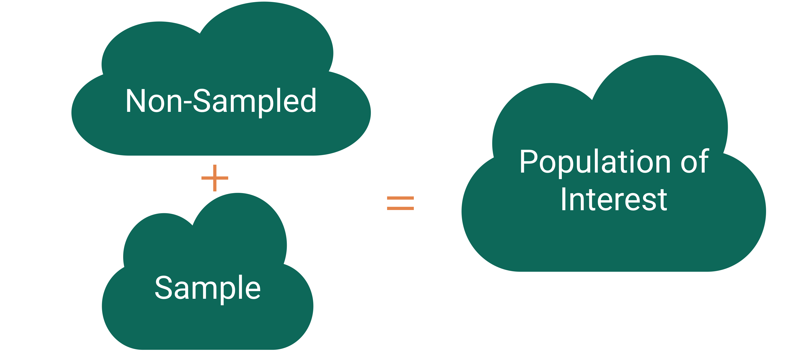
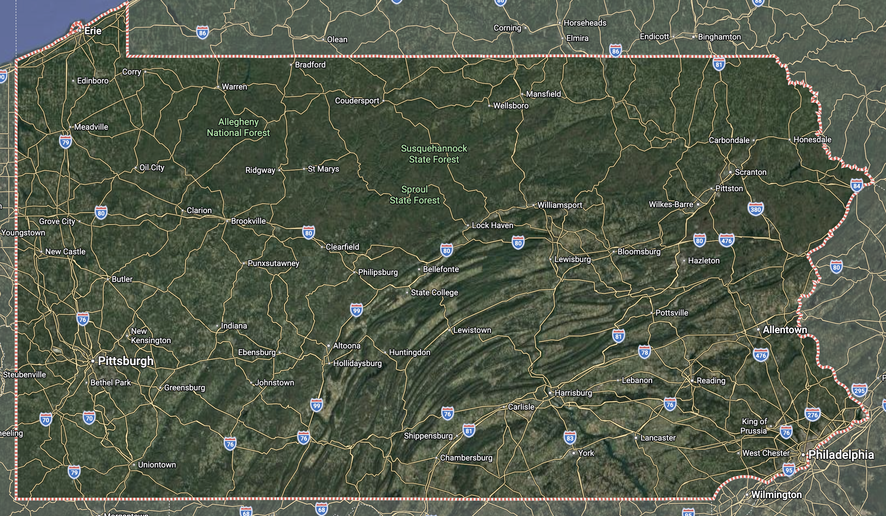

```{r}
#| include: false
#| warning: false
#| message: false
# Some global options still not available in quarto
 knitr::opts_chunk$set(fig.align = 'center')
library(knitr)
library(tidyverse)
theme_update(text = element_text(size = 12))
```

::: columns
::: {.column .center width="45%"}
{width="90%"}
:::

::: {.column .center width="55%"}
[Data Collection]{.custom-title}

<br> <br> <br> <br>

[Kelly McConville]{.custom-subtitle}

[DATA 100 <br> Week 4 \| Spring 2026]{.custom-subtitle}
:::
:::

------------------------------------------------------------------------

## Announcements

-   Next week: Mid-term Exam 1
    - Wed: In-class component
    - Fri: Oral component (over Zoom)
-   Oral practice in lab this week.
    -   Good prep for the mid-term exam.

### Goals for Today

-   Cover data collection/acquisition.

------------------------------------------------------------------------

## Which Are YOU?

::: columns
::: {.column .center width="50%"}
### Data Visualizer

<iframe src="https://giphy.com/embed/d31vTpVi1LAcDvdm" width="680" height="562" frameBorder="0" class="giphy-embed" allowFullScreen>

</iframe>

<p><a href="https://giphy.com/gifs/netflix-d31vTpVi1LAcDvdm">via GIPHY</a></p>
:::

::: {.column .center width="50%"}
### Data Wrangler

<iframe src="https://giphy.com/embed/DbaUtl1DcLyrdwhzGJ" width="680" height="562" frameBorder="0" class="giphy-embed" allowFullScreen>

</iframe>

<p><a href="https://giphy.com/gifs/Amalgia-DbaUtl1DcLyrdwhzGJ">via GIPHY</a></p>
:::
:::

::: fragment
We are looking for any students interested in graphic design to design DATA 100 hex stickers.
:::

------------------------------------------------------------------------

### When to Get Coding Help

`r emo::ji("cry")` *"I have no idea how to do this problem."*

::: fragment
→ Ask someone to point you to an similar example from the lecture, handouts, and guides.
:::

::: fragment
→ Talk it through with someone on the Teaching Team or another DATA 100 student so together we can verbalize the process of going from Q to A.
:::

<br>

::: fragment
`r emo::ji("rage")` *"I am getting a weird error but really think my code is correct/on the right track/matches the examples from class."*
:::

::: fragment
→ It is time for a second pair of eyes. Don't stare at the error for over 10 minutes.
:::

<br>

::: fragment
`r emo::ji("star-struck")` And lots of other times too! `r emo::ji("grimace")`
:::

------------------------------------------------------------------------

### When to Get Help

Remember:

::: fragment
→ Struggling is part of learning.
:::

::: fragment
→ But let us help you ensure it is a **productive** struggle.
:::

::: fragment
→ Struggling does NOT mean you are bad at stats!
:::

------------------------------------------------------------------------

## Now for Data Collection

{width="50%" fig-align="center"}

------------------------------------------------------------------------

## Motivating Our Discussion of Data Collection

{width="50%" fig-align="center"}

## Who are the data supposed to represent?

{width="75%" fig-align="center"}

**Key questions:**

-   What evidence is there that the data are **representative**?
-   Who is present? Who is absent?
-   Who is overrepresented? Who is underrepresented?

------------------------------------------------------------------------

## Who are the data supposed to represent?

{width="80%" fig-align="center"}

**Census**: We have data on the whole population!

------------------------------------------------------------------------

## Who are the data supposed to represent?

{width="85%" fig-align="center"}

------------------------------------------------------------------------

## Who are the data supposed to represent?

{width="75%" fig-align="center"}

**Key questions:**

-   What evidence is there that the **sample** is **representative** of the **population**?
-   Who is present? Who is absent?
-   Who is overrepresented? Who is underrepresented?

------------------------------------------------------------------------

## Sampling Bias

{width="75%" fig-align="center"}

**Sampling bias**: When the sampled units are **systematically different** from the non-sampled units on the variables of interest.

------------------------------------------------------------------------

### Sampling Bias Example

The **Literary Digest** was a political magazine that correctly predicted the presidential outcomes from 1916 to 1932. In 1936, they conducted the most extensive (to that date) public opinion poll. They mailed questionnaires to over 10 million people (about 1/3 of US households) whose names and addresses they obtained from telephone books and vehicle registration lists.

**Population of Interest**:

<br>

**Sample**:

<br>

**Sampling bias**:

------------------------------------------------------------------------

## Random Sampling

Use random sampling (a random mechanism for selecting cases from the population) to remove sampling bias.

#### Types of random sampling

::: nonincremental
-   Simple random sampling

-   Cluster sampling

-   Stratified random sampling

-   Systematic sampling
:::

::: fragment
Why aren't all samples generated using simple random sampling?
:::

------------------------------------------------------------------------

### US Forest Inventory and Analysis Program

::: columns
::: {.column width="15%"}
{fig-align="center"}
:::

::: {.column width="85%"}
> Mission: "Make and keep current a comprehensive inventory and analysis of the present and prospective conditions of and requirements for the renewable resources of the forest and rangelands of the US."
:::
:::

::: fragment
Need a **random sample** of ground plots to say something about the state of our nation's forests!
:::

------------------------------------------------------------------------

### FIA: Simple Random Sampling

::: columns
::: {.column width="50%"}
-   Break the landscape up into equally sized plots (\~1 acre).
-   Number each plot from 1 to 28,635,520.
-   Use a **random** mechanism to sample 4773 plots.

::: fragment
```{r}
sample(x = 1:28635520, size = 4773) %>%
  head()
```
:::
:::

::: {.column width="50%"}
```{r, echo = FALSE}
library(maps)
library(tidyverse)
pa_counties <- map_data("county", "pennsylvania")
ggplot(pa_counties, aes(long, lat, group = group)) +
  geom_polygon(fill = "olivedrab", colour = "olivedrab") + 
  coord_quickmap() +
  theme_void() + 
  geom_vline(xintercept=seq(-80.51989, -74.6851, by = 0.1), size = .2, color = "gray") +
  geom_hline(yintercept=seq(39.71980, 42.26986, by = 0.08), size = .2, color = "gray")
```
:::
:::

::: fragment
Thoughts on this sampling design?
:::

------------------------------------------------------------------------

### FIA: Cluster Random Sampling

::: columns
::: {.column width="50%"}
-   Break the landscape up into equally sized plots (\~1 acre).
-   Put each plot in a cluster.
    -   For our example: cluster = county.
-   Number each cluster.
-   Use a **random** mechanism to sample 2 clusters.
-   Sample **all** plots in those 2 clusters.

::: fragment
```{r}
sample(x = 1:67, size = 2) 
```
:::
:::

::: {.column width="50%"}
```{r, echo = FALSE}
library(maps)
library(tidyverse)
library(paletteer) 
pal <- paletteer_c("grDevices::Plasma", 67)
#pal <- paletteer_c("ggthemes::Sunset-Sunrise Diverging", 67)
#pal <- paletteer_c("pals::ocean.curl", 67)

pa_counties <- map_data("county", "pennsylvania")
ggplot(pa_counties, aes(long, lat, group = group,
                          fill = factor(group))) +
  geom_polygon(colour = "olivedrab") + 
  coord_quickmap() +
  theme_void() +
  geom_vline(xintercept=seq(-80.51989, -74.6851, by = 0.1), size = .2, color = "gray") +
  geom_hline(yintercept=seq(39.71980, 42.26986, by = 0.08), size = .2, color = "gray") +
  scale_fill_manual(values = pal, name = "") +
  theme(legend.position = "bottom", 
        legend.text = element_text(size = 30)) +
  guides(fill = "none")
```
:::
:::

::: fragment
Thoughts on this sampling design?
:::

------------------------------------------------------------------------

### FIA: Cluster Random Sampling

::: columns
::: {.column width="50%"}
::: nonincremental
-   Break the landscape up into equally sized plots (\~1 acre).
-   Put each plot in a cluster.
    -   For our example: cluster = county.
-   Number each cluster.
-   Use a **random** mechanism to sample 2 clusters.
-   Take a **simple random sample** within the sampled clusters.
:::

```{r}
sample(x = 1:67, size = 2) 
```

```{r, eval = FALSE}
sample(x = 1:---, size = ---)
```
:::

::: {.column width="50%"}
```{r, echo = FALSE}
library(maps)
library(tidyverse)
library(paletteer) 


pa_counties <- map_data("county", "pennsylvania")
ggplot(pa_counties, aes(long, lat, group = group,
                          fill = factor(group))) +
  geom_polygon(colour = "olivedrab") + 
  coord_quickmap() +
  theme_void() + 
  geom_vline(xintercept=seq(-80.51989, -74.6851, by = 0.1), size = .2, color = "gray") +
  geom_hline(yintercept=seq(39.71980, 42.26986, by = 0.08), size = .2, color = "gray") +
  scale_fill_manual(values = pal, name = "") +
  theme(legend.position = "bottom", 
        legend.text = element_text(size = 30)) +
  guides(fill = "none")
```
:::
:::

::: fragment
Subsampling within each sampled cluster is much more common than subsampling the whole sampled cluster!
:::

------------------------------------------------------------------------

### FIA: Cluster Random Sampling

::: columns
::: {.column width="50%"}
```{r  out.width = "95%", echo = FALSE, fig.align = 'center'}

```
:::

::: {.column width="50%"}
```{r, echo = FALSE}
ggplot(pa_counties, aes(long, lat, group = group,
                          fill = factor(group))) +
  geom_polygon(colour = "olivedrab") + 
  coord_quickmap() +
  theme_void() + 

  scale_fill_manual(values = pal, name = "") +
  theme(legend.position = "bottom", 
        legend.text = element_text(size = 30)) + 
  guides(fill = "none")
```
:::
:::

-   Are our clusters based on counties **homogeneous**?

-   Why is **homogeneity** important for cluster sampling?

------------------------------------------------------------------------

### FIA: Stratified Random Sampling

::: columns
::: {.column width="50%"}
-   Break the landscape up into equally sized plots (\~1 acre).
-   Put each plot in a stratum.
    -   For our example: stratum = county.
-   Take a **simple random sample** within every stratum.
    -   Don't have to be equally sized!

::: fragment
```{r, eval = FALSE}
# Do this for each stratum
sample(x = 1:---, size = ---)
```
:::
:::

::: {.column width="50%"}
```{r, echo = FALSE}


pa_counties <- map_data("county", "pennsylvania")
ggplot(pa_counties, aes(long, lat, group = group,
                          fill = factor(group))) +
  geom_polygon(colour = "olivedrab") + 
  coord_quickmap() +
  theme_void() + 
  geom_vline(xintercept=seq(-80.51989, -74.6851, by = 0.1), size = .2, color = "gray") +
  geom_hline(yintercept=seq(39.71980, 42.26986, by = 0.08), size = .2, color = "gray") +
  scale_fill_manual(values = pal, name = "") +
  theme(legend.position = "bottom", 
        legend.text = element_text(size = 30)) +
  guides(fill = "none")
```
:::
:::

::: fragment
Thoughts on this sampling design?
:::

------------------------------------------------------------------------

### FIA: Systematic Random Sampling

::: columns
::: {.column width="50%"}
This is FIA's **actual** sampling design (okay, slightly simplified).

-   Break the landscape up into equally sized plots (\~1 acre).
-   Number each plot from 1 to 28,635,520.
-   Use a **random** mechanism to pick starting point. Then sample about once every 6000 acres.

::: fragment
```{r}
sample(x = 1:28635520, size = 1) 
```
:::
:::

::: {.column width="50%"}
```{r, echo = FALSE}
library(maps)
library(tidyverse)
pa_counties <- map_data("county", "pennsylvania")
ggplot(pa_counties, aes(long, lat, group = group)) +
  geom_polygon(fill = "olivedrab", colour = "olivedrab") + 
  coord_quickmap() +
  theme_void() + 
  geom_vline(xintercept=seq(-80.51989, -74.6851, by = 0.1), size = .2, color = "gray") +
  geom_hline(yintercept=seq(39.71980, 42.26986, by = 0.08), size = .2, color = "gray") 
```
:::
:::

::: fragment
Why is this design **better** than simple random sampling?
:::

------------------------------------------------------------------------

### National Health and Nutrition Examination Survey {.smaller}

::: columns
::: {.column width="20%"}
{fig-align="center"}
:::

::: {.column width="80%"}
> Mission: "Assess the health and nutritional status of adults and children in the United States."
:::
:::

How are these data collected?

------------------------------------------------------------------------

### NHANES Sampling Design

-   **Stage 1**: US is stratified by geography and distribution of minority populations. Counties are randomly selected within each stratum.

-   **Stage 2**: From the sampled counties, city blocks are randomly selected. (City blocks are clusters.)

-   **Stage 3**: From sampled city blocks, households are randomly selected. (Households are clusters.)

-   **Stage 4**: From sampled households, people are randomly selected. For the sampled households, a mobile health vehicle goes to the house and medical professionals take the necessary measurements.

::: fragment
**Why don't they use simple random sampling?**
:::

------------------------------------------------------------------------

### Careful Using Non-Simple Random Sample Data

::: columns
::: {.column width="50%"}
```{r, echo = FALSE}
library(NHANES)
library(tidyverse)

ggplot(data = NHANESraw, mapping = aes(x = fct_infreq(Race1),
                                    fill = Race1)) +
  geom_bar() + labs(x = "Race of Respondents", 
                    y = "Count",
                    title = "Original NHANES Data") +
  guides(fill = 'none')
```
:::

::: {.column .fragment width="50%"}
```{r, echo = FALSE}


ggplot(data = NHANES, mapping = aes(x = fct_infreq(Race1),
                                    fill = Race1)) +
  geom_bar() + labs(x = "Race of Respondents", 
                    y = "Count",
                    title = "NHANES Data Adjusted to Mimic SRS") +
  guides(fill = 'none')
```
:::
:::

-   If you are dealing with data collected using a complex sampling design, come chat with me!

# Detour: Data Ethics

------------------------------------------------------------------------

### Data Ethics

> "Good statistical practice is fundamentally based on transparent assumptions, reproducible results, and valid interpretations." -- Committee on Professional Ethics of the American Statistical Association (ASA)

The ASA has created ["Ethical Guidelines for Statistical Practice"](https://www.amstat.org/ASA/Your-Career/Ethical-Guidelines-for-Statistical-Practice.aspx)

::: fragment
→ These guidelines are for EVERYONE doing statistical work.
:::

::: fragment
→ There are ethical decisions at all steps of the Data Analysis Process.
:::

::: fragment
→ We will periodically refer to specific guidelines throughout this class.
:::

::: fragment
> "Above all, professionalism in statistical practice presumes the goal of advancing knowledge while avoiding harm; using statistics in pursuit of unethical ends is inherently unethical."
:::

------------------------------------------------------------------------

## Responsibilities to Research Subjects

> "The ethical statistician protects and respects the rights and interests of human and animal subjects at all stages of their involvement in a project. This includes respondents to the census or to surveys, those whose data are contained in administrative records, and subjects of physically or psychologically invasive research."

------------------------------------------------------------------------

### Responsibilities to Research Subjects

Why do you think the `Age` variable maxes out at 80?

```{r, echo = FALSE, fig.asp = 0.35}
library(tidyverse)
library(NHANES)


ggplot(data = NHANES, mapping = aes(x = Age, y = Height)) +
  geom_point(alpha = 0.1) +
  geom_smooth(color = "skyblue") +
  labs(title = "NHANES: Age versus Height")
```

::: fragment
> "Protects the privacy and confidentiality of research subjects and data concerning them, whether obtained from the subjects directly, other persons, or existing records."
:::

------------------------------------------------------------------------

## Detour from Our Detour

```{r points}
#| output-location: column
library(tidyverse)
library(NHANES)

ggplot(data = NHANES, 
       mapping = aes(x = Age,
                     y = Height)) +
  geom_point(alpha = 0.1) +
  geom_smooth(color = "skyblue")
```

------------------------------------------------------------------------

## Detour from Our Detour

```{r hearts}
#| output-location: column
library(tidyverse)
library(NHANES)
library(emojifont)


NHANES <- mutate(NHANES, 
          heart = fontawesome("fa-heart"))

ggplot(data = NHANES, 
       mapping = aes(x = Age,
                     y = Height,
                     label = heart)) +
  geom_text(alpha = 0.2, color = "red",
            family='fontawesome-webfont',
            size = 6) +
  stat_smooth(color = "deeppink")
```

------------------------------------------------------------------------

### Further Down the Rabbit Hole

```{r}
#| output-location: column
# Generate heart coordinates
t <- seq(-pi,pi,0.04)
x <- 16*0.25*(3*sin(t) - sin(3*t))
y <- 13*cos(t) - 5*cos(2*t) - cos(4*t)
heart_data <- data.frame(x, y)  %>%
  mutate(heart = fontawesome("fa-heart"))

# Make Valentine graph!
ggplot(data = heart_data, 
       mapping = aes(x = x, y = y,
                     label = heart)) +
  geom_text(alpha = 0.2, color = "deeppink",
            family='fontawesome-webfont',
            size = 7) +
  theme_void() + 
  annotate("text", x = 0, y = 2, 
           label = "Happy Valentine's Day", size = 10,
           color = "deeppink3") + 
  annotate("text", x = 0, y = 0, label = "Insert Name",
           size = 10, color = "deeppink3")

```

# Back to Data Collection

------------------------------------------------------------------------

## Who are the data supposed to represent?

{width="75%" fig-align="center"}

------------------------------------------------------------------------

## Who are the data supposed to represent?

{width="60%" fig-align="center"}

**Key questions:**

-   What evidence is there that the **respondents** are **representative** of the **population**?
-   Who is present? Who is absent?
-   Who is overrepresented? Who is underrepresented?

------------------------------------------------------------------------

## Nonresponse bias

{width="60%" fig-align="center"}

**Nonresponse bias**: The respondents are **systematically** different from the non-respondents for the variables of interest.

------------------------------------------------------------------------

### Come Back to Literary Digest Example

Of the 10 million people surveyed, more than 2.4 million responded with 57% indicating that they would vote for Republican Alf Landon in the upcoming presidential election instead of the current President Franklin Delano Roosevelt.

<br>

**Non-response bias**?

------------------------------------------------------------------------

## Tackling Nonresponse bias

{width="60%" fig-align="center"}

-   Use **multiple modes** (mail, phone, in-person) and **multiple attempts** for reaching sampled cases.

-   Explore key demographic variables to see how respondents and non-respondents vary.

-   Take a survey stats course to learn how to create survey weights to adjust for potential nonresponse bias.

------------------------------------------------------------------------

## Is Bigger Always Better?

{width="60%" fig-align="center"}

For our **Literary Digest Example**, Gallup predicted Roosevelt would win based on a survey of **50,000** people (instead of 2.4 million).

------------------------------------------------------------------------

### Big Data Paradox

::: columns
::: {.column width="20%"}
{fig-align="center"}
:::

::: {.column width="80%"}
> "Without taking data quality into account, population inferences with Big Data are subject to a Big Data Paradox: the more the data, the surer we fool ourselves." -- Xiao-Li Meng
:::
:::

**Example:**

-   During Spring of 2021, Delphi-Facebook estimated vaccine uptake at 70% and U.S. Census estimated it at 67%.

-   The CDC reported it to be 53%.

::: fragment
And, once we learn about **quantifying uncertainty**, we will see that large sample sizes produce very small measures of uncertainty.
:::

------------------------------------------------------------------------

### Big Data Paradox

::: columns
::: {.column width="20%"}
{fig-align="center"}
:::

::: {.column width="80%"}
> "If you have the resources, invest in data quality far more than you invest in data quantity. Bad-quality data is essentially wiping out the power you think you have. That's always been a problem, but it's magnified now because we have big data." -- Xiao-Li Meng
:::
:::

------------------------------------------------------------------------

## Thoughts on Sampling

-   **Random** sampling is important to ensure the sample is **representative** of the population.

    -   Word we will use: **generalizability**

-   Representativeness isn't about **size**.

    -   Small random samples will tend to be more representative than large non-random samples.

-   However, I bet most samples you will encounter **won't** have arisen from a random mechanism.

-   How do we draw conclusions about the population from **non-random samples**?

    -   Determinee if your sampled cases (and respondents) are systematically different from the non-sampled cases (and non-respondents) for the variables you care about.
    -   Adjust your population of interest.
    -   Take a survey stats course to learn how to adjust the sample to make it more representative.

# Now let's shift our discussion to the conclusions we can draw from the sample we have.

------------------------------------------------------------------------

### Typical Analysis Goals

**Descriptive**: Want to estimate quantities related to the population.

→ *How many trees are in Alaska?*

::: fragment
**Predictive**: Want to predict the value of a variable.

→ *Can I use remotely sensed data to predict forest types in Alaska?*
:::

::: fragment
**Causal**: Want to determine if changes in a variable cause changes in another variable.

→ *Are insects causing the increased mortality rates for pinyon-juniper woodlands?*
:::

------------------------------------------------------------------------

### Typical Analysis Goals

For these goals will differentiate between the roles of the variables:

-   **Response variable**: Variable I want to better understand

-   **Explanatory/predictor variables**: Variables I think might explain/predict the response variable

::: fragment
→ *How many trees are in Alaska?*

→ *Can I use remotely sensed data to predict forest types in Alaska?*

→ *Are insects causing the increased mortality rates for pinyon-juniper woodlands?*
:::

------------------------------------------------------------------------

### Key Mechanism for Causal Goal

**Random assignment**: Cases are randomly assigned to categories of the **explanatory variable**

-   If the data were collected using **random assignment**, then can determine if the explanatory variable **causes** changes in the response variable.

::: fragment
**Example**: [COVID Vaccine Trials](https://www.nih.gov/news-events/nih-research-matters/experimental-coronavirus-vaccine-highly-effective)

To study the effectiveness of the Moderna vaccine (mRNA-1273), researchers carried out a study on over 30,000 adult volunteers with no known previous COVID-19 infection. Volunteers were randomly assigned to either receive two doses of the vaccine or two shots of saline. The incidence of symptomatic COVID-19 was 94% lower in those who received the vaccine than those who did not.

**Question**: Why does random assignment allow us to conclude that this vaccine was effective at preventing (early strains of) COVID-19?
:::

------------------------------------------------------------------------

## Careful with Non-Random Assignment Data

::: columns
::: {.column width="50%"}
We have data on the number of Methodist ministers in New England and the number of barrels of rum imported into Boston each year. The data range from 1860 to 1940.

-   Should we conclude that ministers drink a lot of rum? Or maybe that rum drinking encourages church attendance?
:::

::: {.column width="50%"}
```{r}
#| echo: false


library(Lock5withR)
ggplot(data = MinistersRum, mapping = aes(x = Ministers, 
                                          y = Rum)) +
  geom_point(alpha = 0.6, size = 4, color = "green4")
```
:::
:::

-   **Confounding variable**: A third variable that is associated with both the explanatory variable and the response variable.

-   Unclear if the explanatory variable or the confounder (or some other variable) is causing changes in the response.

------------------------------------------------------------------------

## Causal Inference

-   **Spurious relationship**: Two variables are associated but not causally related
    -   In the age of big data, lots of good examples [out there](https://tylervigen.com/spurious-correlations).

::: fragment
→ *"Correlation does not imply causation."*
:::

::: fragment
→ *"Correlation does not imply not causation."*
:::

-   **Causal inference**: Methods for finding causal relationships even when the data were collected without random assignment.

# Types of Studies

------------------------------------------------------------------------

## Observational Studies

-   A study in which the researchers don't actively control the value of any variable, but simply observe the values as they naturally exist.

-   **Example**: Hand washing study

    -   To estimate what percent of people in the US wash their hands after using a public restroom, researchers pretended to comb their hair while observing 6000 people in public restrooms throughout the United States. They found that 85% of the people who were observed washed their hands after going to the bathroom.

------------------------------------------------------------------------

## (Randomized) Experiment

-   A study in which the researcher actively controls one or more of the explanatory variables through random assignment.

-   **Example**: COVID Trial

-   Common features:

    -   **Control** group that gets no treatment or a standard treatment
    -   **Placebo**: A fake treatment to control for the **placebo effect** where if people believe they are receiving a treatment, they may experience the desired effect regardless of whether the treatment is any good.
    -   **Blinding**: When the subjects and/or researchers don't know the explanatory group assignments.

------------------------------------------------------------------------

## Thoughts on Data Collection Goals

-   Random assignment allows you to explore **causal** relationships between your explanatory variables and the predictor variables because the randomization makes the explanatory groups roughly similar.

-   How do we draw causal conclusions from studies without random assignment?

    -   With extreme care! Try to **control** for all possible confounding variables.
    -   Discuss the associations/correlations you found. Use domain knowledge to address potentially causal links.
    -   Take more stats to learn more about causal inference.

-   But also consider the goals of your analysis. Often the research question isn't causal.

-   **Bottom Line:** We often have to use imperfect data to make decisions.
