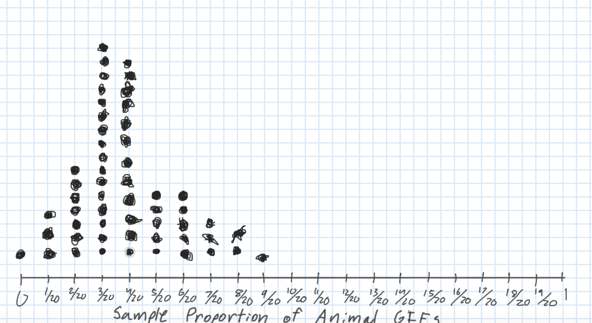

```{r}
#| include: false
#| warning: false
#| message: false
# Some global options still not available in quarto
 knitr::opts_chunk$set(fig.align = 'center')
library(knitr)
library(tidyverse)
theme_update(text = element_text(size = 16))
```

::: columns
::: {.column .center width="45%"}
{width="90%"}
:::

::: {.column .center width="55%"}
[Quantifying Uncertainty]{.custom-title}

<br> <br>

[Kelly McConville]{.custom-subtitle}

[DATA 100 <br> Week 8 \| Spring 2026]{.custom-subtitle}
:::
:::

------------------------------------------------------------------------

## Announcements

-   Remember that the code in your problem sets should be your own.
-   Load the relevant packages at the top of the Quarto document.

::: fragment

```{r}
library(tidyverse)
library(moderndive)
```

:::


### Goals for Today

::: columns
::: column
-   Models beyond linear regression
-   Modeling & Ethics: Algorithmic bias
-   Quantifying uncertainty
:::

::: column
-   Sampling variability
-   Sampling distributions
:::
:::


-----
  
### Beyond Linear Regression
  
  
::::: columns
::: column

**Neural Networks**
  
* What people are talking about right now when they say *"AI models*.

* Linear regression on steroids:
    + Layers and layers of transformed linear regression models.
    + In simple linear regression we have two model parameters: $\beta_o$ and $\beta_1$.
    + In Gemini 3 Flash, there are between 1.2 and 1.8 trillion parameters.

* Won't fit in DATA 100 but will interact with fitted models.

:::


::: column

**Regression Trees**

* Useful if 
    + Have a lot of categorical variables (with many categories).
    + Expect local interaction effects.
* When the response variable is categorical, then called **Classification Trees**.
* Let's explore fitting and interpreting these models.


:::
:::::


------------------------------------------------------------------------

### Example: Return to the Candy Example

* Want to predict when a candy will win!
* Let's focus on just the categorical explanatory variables.
  + Though trees can handle both types.

::: fragment


```{r}
# Wrangling the data
candy <- read_csv("https://raw.githubusercontent.com/fivethirtyeight/data/master/candy-power-ranking/candy-data.csv") %>%
  mutate(pricepercent = pricepercent*100) %>%
  select(-competitorname, - sugarpercent, -pricepercent) %>%
  mutate(across(.cols = -winpercent, .fns = ~
                  case_when(.x == 1 ~ "yes",
                            .x == 0 ~ "no")))

glimpse(candy)

```


:::


------------------------------------------------------------------------

### Regression Trees

-   Model form is very different from linear regression.
-   Split sample into two groups based on an explanatory variable.
    -   Wants groups to be homogeneous as possible for the response variable.


::: fragment

::: columns
::: {.column width="25%"}
:::

::: {.column width="50%"}

```{r}
#| echo: false
library(rpart)
set.seed(3344)
candy_tree <- rpart(winpercent ~ ., data = candy, method = "anova", 
                   control = rpart.control(cp = 0, minsplit = 2, minbucket = 10))

library(rattle)
candy_tree_pruned <- prune(candy_tree, cp = 0.056141 )
fancyRpartPlot(candy_tree_pruned, cex  =  2, caption = "", 
               type = 4)

```


:::

::: {.column width="25%"}
:::
:::

:::


------------------------------------------------------------------------

### Regression Trees

-   Split the subgroups to make subsubgroups that are even more homogeneous.


::: fragment

::: columns
::: {.column width="20%"}
:::

::: {.column width="60%"}

```{r}
#| echo: false
candy_tree_pruned <- prune(candy_tree, cp = 0.044027)
fancyRpartPlot(candy_tree_pruned, cex  =  1, caption = "", 
               type = 4)

```


:::

::: {.column width="20%"}
:::
:::

:::


------------------------------------------------------------------------

### Regression Trees

-   Keep going until you have a big tree.


::: fragment

::: columns
::: {.column width="20%"}
:::

::: {.column width="60%"}

```{r}
#| echo: false
candy_tree_pruned <- prune(candy_tree, cp = 0)
fancyRpartPlot(candy_tree_pruned, cex  =  1, caption = "", 
               type = 4)

```


:::

::: {.column width="20%"}
:::
:::

:::


------------------------------------------------------------------------

### Regression Trees

-   Then prune back the splits that aren't very predictive/useful to get the optimal tree.


::: fragment

::: columns
::: {.column width="20%"}
:::

::: {.column width="60%"}

```{r}
#| echo: false
candy_tree_pruned <- prune(candy_tree, cp = 0.011298)
fancyRpartPlot(candy_tree_pruned, cex  =  1, caption = "", 
               type = 4)

```


:::

::: {.column width="20%"}
:::
:::

:::


----

### Coding Regression Trees

Let's see how to code up what we just did.


```{r}
# Package to fit the tree
library(rpart)

# Package to visualize the tree
library(rattle)

# Set the random seed so that I get the same tree each time
set.seed(3344)
```

----

### Coding Regression Trees

::: nonincremental

* Fit the regression tree.
* `cp` = complexity parameter
    + `cp = 0` (Grow a very large tree).
    + `minsplit` = smallest tree allowed.
    + `minbucket` = how many cases need to be in each bucket of the tree.
    
:::

```{r}
candy_tree <- rpart(winpercent ~ ., data = candy, 
                    method = "anova", 
                    control = rpart.control(cp = 0, 
                                            minsplit = 2,
                                            minbucket = 10))
```

---

### Coding Regression Trees

::: nonincremental

* Look at the amount of error for different cost penalties.
* Pick the `cp` where the `xerror` is the lowest (or nearly the lowest).

:::

```{r}
printcp(candy_tree)
```

---

### Coding Regression Trees

Best `cp` for this example is just above 0.011297.

::: fragment

::: columns
::: {.column width="25%"}
:::

::: {.column width="50%"}


```{r}
candy_tree_pruned <- prune(candy_tree, cp = 0.011297 + 0.000001)
fancyRpartPlot(candy_tree_pruned, cex  =  1, caption = "", type = 4)
```


:::

::: {.column width="25%"}
:::
:::

:::


------------------------------------------------------------------------

### Prediction

Can still use the `predict()` function to predict new observations.

```{r}
twix <- data.frame(chocolate = "yes", peanutyalmondy = "no", crispedricewafer = "yes",
                   bar = "yes", fruity = "no", caramel = "yes", nougat = "no", 
                   hard = "no", pluribus = "no")
twix
predict(candy_tree_pruned, newdata = twix)

```


# Data Ethics: Algorithmic Bias

[Return to the Americian Statistical Association's ["Ethical Guidelines for Statistical Practice"](https://www.amstat.org/ASA/Your-Career/Ethical-Guidelines-for-Statistical-Practice.aspx)]{.custom-subtitle}

------------------------------------------------------------------------

## Integrity of Data and Methods

> "The ethical statistical practitioner seeks to understand and mitigate known or suspected limitations, defects, or biases in the data or methods and communicates potential impacts on the interpretation, conclusions, recommendations, decisions, or other results of statistical practices."

> "For models and algorithms designed to inform or implement decisions repeatedly, develops and/or implements plans to validate assumptions and assess performance over time, as needed. Considers criteria and mitigation plans for model or algorithm failure and retirement."

------------------------------------------------------------------------

### Algorithmic Bias

**Algorithmic bias**: when the model systematically creates unfair outcomes, such as privileging one group over another.

**Example**: [The Coded Gaze](https://www.youtube.com/watch?v=162VzSzzoPs)

```{r, echo = FALSE, out.width='35%', fig.cap = "Joy Buolamwini"}

```

-   Facial recognition software struggles to see faces of color.

-   Algorithms built on a non-diverse, biased dataset.

------------------------------------------------------------------------

### Algorithmic Bias

**Algorithmic bias**: when the model systematically creates unfair outcomes, such as privileging one group over another.

**Example**: [COMPAS model](https://www.propublica.org/article/machine-bias-risk-assessments-in-criminal-sentencing) used throughout the country to predict recidivism

::: nonincremental
-   Differences in predictions across race and gender
:::

```{r, echo = FALSE, out.width='45%', fig.cap = "ProPublica Analysis"}
knitr::include_graphics("img/compas.png")
```

-   Cynthia Rudin and collaborators wrote [The Age of Secrecy and Unfairness in Recidivism Prediction](https://hdsr.mitpress.mit.edu/pub/7z10o269/release/7)
    -   Argue for the need for transparency in models that make such important decisions.

# Shift Gears: Statistical Inference

------------------------------------------------------------------------

### The `r emo::ji("heart")` of statistical inference is quantifying uncertainty

```{r, echo = FALSE, out.width='70%'}
knitr::include_graphics("img/week4.005.jpeg")
```

::: fragment
```{r}
library(tidyverse)
ce <- read_csv("data/fmli.csv")
summarize(ce, meanFINCBTAX = mean(FINCBTAX))
```
:::

------------------------------------------------------------------------

### The `r emo::ji("heart")` of statistical inference is quantifying uncertainty

```{r}
library(tidyverse)
ce <- read_csv("data/fmli.csv")
summarize(ce, meanFINCBTAX = mean(FINCBTAX))
```

Like with regression, need to distinguish between the **population** and the **sample**

::: columns
::: column
::: nonincremental
-   **Parameters**:
    -   Based on the **population**
    -   Unknown then if don't have data on the whole population
    -   EX: $\beta_o$ and $\beta_1$
    -   EX: $\mu$ = population mean
:::
:::

::: column
::: nonincremental
-   **Statistics**:
    -   Based on the **sample** data
    -   Known
    -   Usually estimate a population parameter
    -   EX: $\hat{\beta}_o$ and $\hat{\beta}_1$
    -   EX: $\bar{x}$ = sample mean
:::
:::
:::

------------------------------------------------------------------------

### Quantifying Our Uncertainty

`R` has been giving us uncertainty estimates:

```{r}
#| output-location: column

library(Stat2Data)
data("Pollster08")

ggplot(Pollster08, aes(x = Days,
                       y = Margin, 
                       color = factor(Charlie))) +
  geom_point() +
  stat_smooth(method = "lm", se = TRUE) +
  theme(legend.position = "bottom")

```

------------------------------------------------------------------------

### Quantifying Our Uncertainty

`R` has been giving us uncertainty estimates:

```{r}
library(Stat2Data)
data("Pollster08")
modPoll <- lm(Margin ~ Days*factor(Charlie), data = Pollster08)
library(moderndive)
get_regression_table(modPoll)
```

------------------------------------------------------------------------

### Quantifying Our Uncertainty

The [news and journal articles](https://www.pewresearch.org/fact-tank/2019/12/17/more-u-s-homeowners-say-they-are-considering-home-solar-panels/) are also giving us uncertainty estimates:

::: columns
::: column
```{r  out.width = "55%", echo=FALSE, fig.align='center'}
include_graphics("img/solar_panels.png") 
```
:::

::: column
```{r  out.width = "85%", echo=FALSE, fig.align='center'}
include_graphics("img/margin_of_error.png") 
```
:::
:::

------------------------------------------------------------------------

### Quantifying Our Uncertainty

The [news and journal articles](https://rss.onlinelibrary.wiley.com/doi/abs/10.1111/1740-9713.01501) are also giving us uncertainty estimates:

```{r  out.width = "65%", echo=FALSE, fig.align='center'}
include_graphics("img/ci_swimming.png") 
```

------------------------------------------------------------------------

### Statistical Inference

**Goal**: Draw conclusions about the population based on the sample.

**Main Flavors**

-   Estimating numerical quantities (parameters).

-   Testing conjectures.

------------------------------------------------------------------------

### Estimation

**Goal**: Estimate a (population) parameter.

Best guess?

-   The corresponding (sample) statistic


::: fragment
**Example**: What one word would you use to describe Bucknell?

:::

------------------------------------------------------------------------

### Estimation

**Key Question**: How accurate is the statistic as an estimate of the parameter?

**Helpful Sub-Question**: If we take many samples, how much would the statistic vary from sample to sample?

Need two new concepts:

-   The **sampling variability** of a statistic

-   The **sampling distribution** of a statistic

# Let's learn about these ideas through an activity! 

------------------------------------------------------------------------

## Sampling Distribution of a Statistic

Steps to Construct an (Approximate) Sampling Distribution:

1.  Decide on a sample size, $n$.

2.  Randomly select a sample of size $n$ from the population.

3.  Compute the sample statistic.

4.  Put the sample back in.

5.  Repeat Steps 2 - 4 many (1000+) times.

------------------------------------------------------------------------

## Sampling Distribution of a Statistic

```{r  out.width = "55%", echo=FALSE, fig.align='center'}
 
```

::: columns
::: column
-   Center? Shape?

-   Spread?

    -   Standard error = standard deviation of the statistic
:::

::: column
-   What happens to the center/spread/shape as we increase the sample size?

-   What happens to the center/spread/shape if the true parameter changes?
:::
:::


