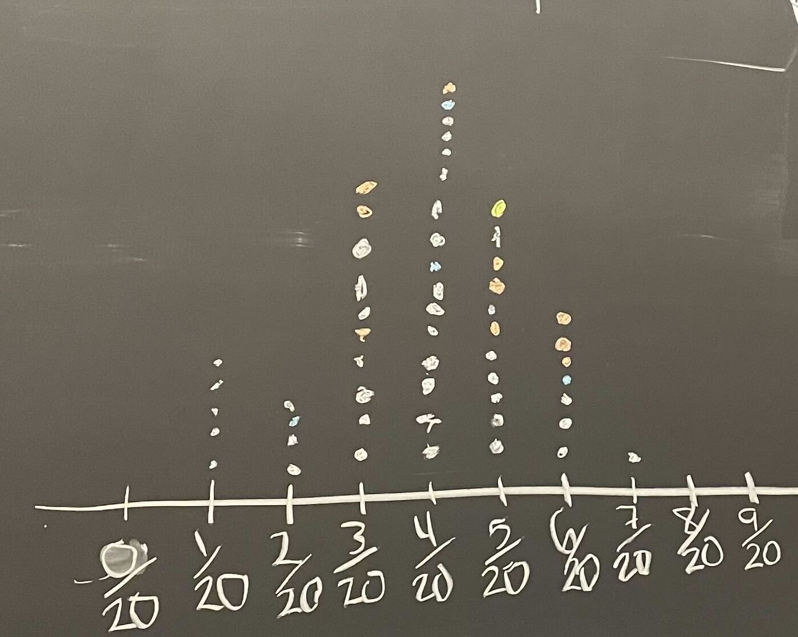

```{r}
#| include: false
#| warning: false
#| message: false
# Some global options still not available in quarto
 knitr::opts_chunk$set(fig.align = 'center')
library(knitr)
library(tidyverse)
theme_update(text = element_text(size = 16))
```

# Grab 30 notecards! It is okay if they already have markings on them. And, please return the notecards to the same spot after class. {.unnumbered .unlisted}

------------------------------------------------------------------------

::::: columns
::: {.column .center width="45%"}
{width="90%"}
:::

::: {.column .center width="55%"}
[Confidence Intervals]{.custom-title}

<br> <br>

[Kelly McConville]{.custom-subtitle}

[DATA 100 <br> Week 8 \| Spring 2026]{.custom-subtitle}
:::
:::::

------------------------------------------------------------------------

## Announcements

-   P-Set 5 is due tomorrow at noon.
-   Interesting sports analytics talk tomorrow at noon in Taylor 212. Sign up to attend: <https://forms.gle/771gNTLQjtUH1Jbo6>

### Goals for Today

::::: columns
::: column
-   Estimation
-   Sampling distributions
:::

::: column
-   Bootstrap distributions
-   Bootstrapped confidence intervals
:::
:::::

# `r emo::ji("thinking")` The second half of DATA 100 is more conceptually difficult. `r emo::ji("thinking")`

[So keep coming to lecture, to lab, and to office hours to get your questions answered!]{.custom-subtitle}

------------------------------------------------------------------------

## Statistical Inference

**Goal**: Draw conclusions about the population based on the sample.

**Main Flavors**

-   Estimating numerical quantities (parameters).

-   Testing conjectures.

------------------------------------------------------------------------

## Sampling Distribution of a Statistic

::::: columns
::: column
```{r  out.width = "85%", echo=FALSE, fig.align='center'}
 
```
:::

::: column
Steps to Construct an (Approximate) Sampling Distribution:

1.  Decide on a sample size, $n$.

2.  Randomly select a sample of size $n$ from the population.

3.  Compute the sample statistic.

4.  Put the sample back in.

5.  Repeat Steps 2 - 4 many (1000+) times.
:::
:::::

## Sampling Distribution

::::: columns
::: column
```{r  out.width = "85%", echo=FALSE, fig.align='center'}
 
```
:::

::: column
-   What are some of the key features of a sampling distribution?

-   Key Questions:

    -   How do sampling distributions help us **quantify uncertainty**?
    -   If I am estimating a parameter in a real example, why **won't** I be able to construct the sampling distribution?
:::
:::::

------------------------------------------------------------------------

## Let's Construct Some Sampling Distributions using `R`!

**Important Notes**

-   To construct a **sampling distribution** for a statistic, we need access to the entire population so that we can take **repeated samples** from the population.

    -   Population = Trees in parks in Portland, OR

-   But if we have access to the entire population, then we **know** the value of the population parameter.

    -   Know that 26.6% of trees in Portland parks are Douglas-Fir.

-   The sampling distribution is needed in the exact scenario where we can't compute it: the scenario where we only have a **single sample**.

-   Right now, we have the **entire population** and are constructing sampling distributions anyway to better understand their behaviors!

------------------------------------------------------------------------

## New `R` Packages

::::: columns
::: {.column width="20%"}
{width="100%" fig-align="center"}
:::

::: {.column width="80%"}
<br> <br> <br>

```{r}
library(infer)
```

Will use `infer` to conduct statistical inference.
:::
:::::

::::::: columns
::: {.column width="3%"}
:::

::: {.column width="12%"}
{width="100%" fig-align="center"}
:::

::: {.column width="5%"}
:::

::: column
<br>

```{r}
library(pdxTrees)
```

Will use `pdxTrees` to access data on trees in Portland, OR parks.
:::
:::::::

------------------------------------------------------------------------

## Our Population Parameter

Grab data on ALL the trees in parks in Portland, OR:

```{r}
library(tidyverse)
library(pdxTrees)
park_trees <- get_pdxTrees_parks()
```

Add variable of interest:

```{r}
park_trees <- park_trees %>%
  mutate(tree_of_interest = case_when(
    Common_Name == "Douglas-Fir" ~ "yes",
    Common_Name != "Douglas-Fir" ~ "no"
  ))
count(park_trees, tree_of_interest)
```

------------------------------------------------------------------------

## Population Parameter

```{r}
#| output-location: column

# Population distribution
ggplot(data = park_trees, 
       mapping = aes(x = tree_of_interest)) +
  geom_bar(aes(y = ..prop.., group = 1),
           stat = "count") 

# True population parameter
summarize(park_trees, 
          parameter = mean(tree_of_interest == "yes"))

```

------------------------------------------------------------------------

### Random Samples

Let's look at 4 random samples.

```{r, fig.width = 8, fig.height = 4}
#| output-location: column

# Draw random samples
samples <- park_trees %>% 
  rep_sample_n(size = 20, reps = 4)
  
# Graph the samples
ggplot(data = samples, 
       mapping = aes(x = tree_of_interest)) +
  geom_bar(aes(y = ..prop.., group = 1),
           stat = "count") +
  facet_wrap( ~ replicate)
```

------------------------------------------------------------------------

### Constructing the Sampling Distribution

Now, let's take 1000 random samples.

```{r}
#| output-location: column
# Construct the sampling distribution
samp_dist <- park_trees %>% 
  rep_sample_n(size = 20, reps = 1000) %>%
  group_by(replicate) %>%
  summarize(statistic = 
              mean(tree_of_interest == "yes"))

# Graph the sampling distribution
ggplot(data = samp_dist, 
       mapping = aes(x = statistic)) +
  geom_histogram(bins = 14)
```

:::::: columns
::: {.column width="33%"}
-   Shape?
:::

::: {.column width="33%"}
-   Center?
:::

::: {.column width="33%"}
-   Spread?
:::
::::::

------------------------------------------------------------------------

### Properties of the Sampling Distribution

::::: columns
::: column
```{r}
#| echo: false
# Construct the sampling distribution
samp_dist <- park_trees %>% 
  rep_sample_n(size = 20, reps = 1000) %>%
  group_by(replicate) %>%
  summarize(statistic = 
              mean(tree_of_interest == "yes"))

# Graph the sampling distribution
ggplot(data = samp_dist, 
       mapping = aes(x = statistic)) +
  geom_histogram(bins = 13)
```
:::

::: column
```{r}
summarize(samp_dist, mean(statistic))
summarize(samp_dist, sd(statistic))
```
:::
:::::

The standard deviation of a sample statistic is called the **standard error**.

------------------------------------------------------------------------

What happens to the sampling distribution if we change the sample size from 20 to 100?

```{r}
#| output-location: column
# Construct the sampling distribution
samp_dist <- park_trees %>% 
  rep_sample_n(size = 100, reps = 1000) %>%
  group_by(replicate) %>%
  summarize(statistic = 
              mean(tree_of_interest == "yes"))

# Graph the sampling distribution
ggplot(data = samp_dist, 
       mapping = aes(x = statistic)) +
  geom_histogram(bins = 20)

summarize(samp_dist, mean(statistic), 
          sd(statistic))
```

------------------------------------------------------------------------

What if we change the true parameter value?

```{r}
#| output-location: column
# Construct the sampling distribution
samp_dist <- park_trees %>%
  rep_sample_n(size = 20, reps = 1000) %>%
  group_by(replicate) %>%
  summarize(statistic =
              mean(Common_Name == 
                     "Japanese Flowering Cherry"))

# Graph the sampling distribution
ggplot(data = samp_dist,
       mapping = aes(x = statistic)) +
    geom_histogram(bins = 20)

summarize(samp_dist, mean(statistic),
          sd(statistic))
```

# On Next Problem Set:

[Will investigate what happens when we change the parameter of interest to a mean or a correlation coefficient!]{.custom-subtitle}

------------------------------------------------------------------------

## Key Features of a Sampling Distribution

What did we learn about sampling distributions?

-   Centered around the true population parameter.

-   As the sample size increases, the **standard error** (SE) of the statistic decreases.

-   As the sample size increases, the shape of the sampling distribution becomes more bell-shaped and symmetric.

-   **Question:** How do sampling distributions help us **quantify uncertainty**?

------------------------------------------------------------------------

## Estimation

**Goal**: Estimate the value of a population parameter using data from the sample.

-   **Question**: How do I know which population parameter I am interesting in estimating?

-   **Answer**: Likely depends on the research question and structure of your data!

-   **Point Estimate**: The corresponding statistic

    -   Single best guess for the parameter

::: fragment
```{r}
library(tidyverse)
ce <- read_csv("data/fmli.csv")
summarize(ce, meanFINCBTAX = mean(FINCBTAX))
```
:::

------------------------------------------------------------------------

### Potential Parameters and Point Estimates/Statistics

------------------------------------------------------------------------

## Confidence Intervals

::::: columns
::: column
It is time to move **beyond** just point estimates to interval estimates that quantify our uncertainty.
:::

::: column
```{r}
summarize(ce, meanFINCBTAX = mean(FINCBTAX))
```
:::
:::::

-   **Confidence Interval**: Interval of **plausible** values for a parameter

-   **Form**: $\mbox{statistic} \pm \mbox{Margin of Error}$

-   **Question**: How do we find the Margin of Error (ME)?

-   **Answer**: If the sampling distribution of the statistic is approximately bell-shaped and symmetric, then a statistic will be within 2 SEs of the parameter for 95% of the samples.

-   **Form**: $\mbox{statistic} \pm 2\mbox{SE}$

-   Called a 95% confidence interval (CI). (Will discuss the meaning of **confidence** soon)

------------------------------------------------------------------------

## Confidence Intervals

**95% CI Form**:

$$
\mbox{statistic} \pm 2\mbox{SE}
$$

Let's use the `ce` data to produce a CI for the average household income before taxes.

```{r}
summarize(ce, meanFINCBTAX = mean(FINCBTAX))
```

What else do we need to construct the CI?

-   **Problem**: To compute the SE, we need many samples from the population. We have 1 sample.

-   **Solution**: Approximate the sampling distribution using **ONLY OUR ONE SAMPLE!**

------------------------------------------------------------------------

### Bootstrap Distribution

How do we approximate the sampling distribution?

:::: columns
::: {.column width="\"50%"}
**Bootstrap Distribution of a Sample Statistic**:

1.  Take a sample of size $n$ **with replacement** from the sample. Called a bootstrap sample.

2.  Compute the statistic on the bootstrap sample.

3.  Repeat 1 and 2 many (1000+) times.
:::
::::

------------------------------------------------------------------------

### Let's Practice Generating Bootstrap Samples!

**Example:** In a recent study, 23 rats showed compassion that surprised scientists. Twenty-three of the 30 rats in the study freed another trapped rat in their cage, even when chocolate served as a distraction and even when the rats would then have to share the chocolate with their freed companion. (Rats, it turns out, love chocolate.) Rats did not open the cage when it was empty or when there was a stuffed animal inside, only when a fellow rat was trapped. We wish to use the sample to estimate the proportion of rats that show empathy in this way.

**Parameter**:

**Statistic**:

Use your 30 cards to take a bootstrap sample. (Make sure to appropriately label them first!)

Compute the bootstrap statistic and put it on the class dotplot.

(Will use these data for one of the problems in the next p-set.)

------------------------------------------------------------------------

### Sampling Distribution Versus Bootstrap Distribution

::: nonincremental
-   Data needed:

<br> <br> <br>

-   Center:

<br> <br> <br>

-   Spread:
:::

------------------------------------------------------------------------

### (Bootstrapped) Confidence Intervals

**95% CI Form**:

$$
\mbox{statistic} \pm 2\mbox{SE}
$$

We approximate $\mbox{SE}$ with $\widehat{\mbox{SE}}$ = the standard deviation of the bootstrapped statistics.

Caveats:

-   Assuming a random sample

-   Even with random samples, sometimes we get non-representative samples. Bootstrapping can't fix that.

-   Assuming the bootstrap distribution is bell-shaped and symmetric

------------------------------------------------------------------------

### Bootstrapped Confidence Intervals

#### Two Methods

Assuming random sample and roughly bell-shaped and symmetric bootstrap distribution for both methods.

**SE Method 95% CI**:

$$
\mbox{statistic} \pm 2\widehat{\mbox{SE}}
$$

We approximate $\mbox{SE}$ with $\widehat{\mbox{SE}}$ = the standard deviation of the bootstrapped statistics.

**Percentile Method CI:**

If I want a P% confidence interval, I find the bounds of the middle P% of the bootstrap distribution.

# How can we construct bootstrap distributions and bootstrapped CIs in R?

------------------------------------------------------------------------

## Load Packages and Data

```{r}
library(tidyverse)
library(infer)
```

Let's return to the movies dataset and estimate numerical quantities about Hollywood movies.

```{r}
# Read in data
movies <- read_csv("https://www.lock5stat.com/datasets2e/HollywoodMovies.csv")
```

------------------------------------------------------------------------

## Estimation for a Single Mean

What is the average amount of money $(\mu)$ made in the opening weekend?

```{r}
# Compute the summary statistic
x_bar <- movies %>%
  drop_na(OpeningWeekend) %>%
  specify(response = OpeningWeekend) %>%
  calculate(stat = "mean")
x_bar
```

-   Why is our numerical quantity a mean and not a proportion or correlation here?

------------------------------------------------------------------------

## Estimation for a Single Mean

```{r}
#| output-location: column
set.seed(999)


# Construct bootstrap distribution
bootstrap_dist <- movies %>%
  drop_na(OpeningWeekend) %>%
  specify(response = OpeningWeekend) %>%
  generate(reps =  1000, type = "bootstrap") %>%
  calculate(stat = "mean")

# Look at bootstrap distribution
ggplot(data = bootstrap_dist, 
       mapping = aes(x = stat)) +
  geom_histogram(color = "white")
```

------------------------------------------------------------------------

## Estimation for a Single Mean -- SE Method

```{r}
#| output-location: column

# Get confidence interval
ci <- bootstrap_dist %>% 
  get_confidence_interval(type = "se", level = 0.95,
                          point_estimate = x_bar)
ci
```

**Interpretation:** The point estimate is \$ `r round(x_bar$stat, digits = 1)`M. I am 95% confidence that the average amount of money made by all Hollywood movies is between \$ `r ci$lower_ci`M and \$ `r round(ci$upper_ci, digits = 1)`M.

**Inline `R` code?**

------------------------------------------------------------------------

## Estimation for a Single Mean

```{r}
#| output-location: column
# Visualize confidence interval
bootstrap_dist %>%
  visualize() +
  shade_confidence_interval(endpoints = ci)
```

------------------------------------------------------------------------

## Estimation for a Single Mean -- Percentile Method

```{r}
#| output-location: column

# Get confidence interval 
ci_95 <- bootstrap_dist %>% 
  get_confidence_interval(type = "percentile",
                          level = 0.95) 
ci_95
```

------------------------------------------------------------------------

## Reminders

-   P-Set 5 is due tomorrow at noon.
-   Interesting sports analytics talk tomorrow at noon in Taylor 212. Sign up to attend: <https://forms.gle/771gNTLQjtUH1Jbo6>
