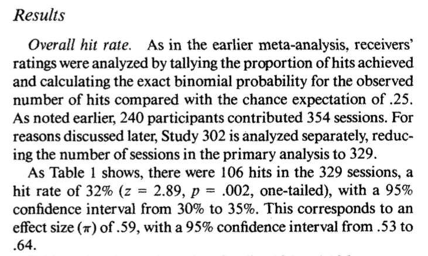

```{r}
#| include: false
#| warning: false
#| message: false
# Some global options still not available in quarto
 knitr::opts_chunk$set(fig.align = 'center')
library(knitr)
library(tidyverse)
theme_update(text = element_text(size = 16))
```

------------------------------------------------------------------------

::::: columns
::: {.column .center width="45%"}
{width="90%"}
:::

::: {.column .center width="55%"}
[Decisions, Decisions]{.custom-title}

<br> <br> <br>

[Kelly McConville]{.custom-subtitle}

[DATA 100 <br> Week 10 \| Spring 2026]{.custom-subtitle}
:::
:::::

------------------------------------------------------------------------

## Announcements

::: nonincremental
-   `r emo::ji("tada")` We are now accepting **data science student fellow applications** for DATA 100.
    -   About 10-12 hours of work per week.\
    -   Primary responsibilities: Work on a collaborative, mentored data or AI project, attend relevant meetings, and participate in DCDS ambassador activities.
:::

### Goals for Today

::::: columns
::: column
-   Coding goals (DATA 100 & beyond)
-   Advice on the next data science class
:::

::: column
-   Hypothesis testing example
-   **Decisions** in a hypothesis test
    -   Types of errors
-   The **power** of a hypothesis test
:::
:::::

# Now that you have discovered your love of data, what class should you take next?

------------------------------------------------------------------------

## That Next Data Science Class

-   But first... **Common Question**: How should I describe my post-DATA 100 coding abilities?

-   **Potential Answer**: You have learned how to write code **to analyze data**. This includes visualization (`ggplot2`), data wrangling (`dplyr`), data importation (`readr`), modeling, inference (`infer`) and communication (with `Quarto`).

-   **Follow-up Question**: So what coding is there left to learn?

-   **Answer**: Learning how to **program**. This includes topics such as control flow, iteration, creating functions, and vectorization. Also, learning how to use an **AI tool** effectively and ethically to support your code generation and how to debug AI code suggestions.

------------------------------------------------------------------------

## That Next Coding Class

::: nonincremental
-   CSCI 187. Creative Computing & Society: Computing, Creativity & the Social Good.
-   CSCI 203. Introduction to Computer Science.
-   ANOP 203. Introduction to Programming for Business Analytics.
:::

## That Next Modeling Course

::: nonincremental
-   STAT 217. Statistics II
-   CSCI 349. Applied Machine Learning.
-   ANOP 330. Predictive Analytics: Machine Learning Fundamentals for Business.
-   Many of the upper-level stats courses are modeling courses (but they do have pre-reqs).
:::

## That Next Visualization Course

::: nonincremental
-   STAT 230. Data Visualization & Computing
-   ANOP 270. Data Visualization for Business Analytics.
:::

# Feel free to stop by office hours or send me a Slack note if you have advising questions!

# Now: A closer look at the conclusions of a hypothesis test

------------------------------------------------------------------------

## Hypothesis Testing Framework

-   Set-up hypotheses:

    -   Be able to express in words and in terms of parameters.

-   Collect data.

-   Assume $H_o$ is correct.

-   Compute a p-value to quantify the likelihood of the sample results using a test statistic.

-   **Draw a conclusion about the alternative hypothesis.**

------------------------------------------------------------------------

### Hypothesis Testing: Decisions, Decisions

Once you get to the end of a hypothesis test you make one of two decisions:

-   P-value is small.
    -   Reject $H_o$.
    -   **I have evidence for** $H_a$.
-   P-value is not small.
    -   Fail to reject $H_o$.
    -   **I don't have evidence for** $H_a$.

::: fragment
Sometimes we make the correct decision. Sometimes we make a mistake.
:::

------------------------------------------------------------------------

### Hypothesis Testing: Decisions, Decisions

Let's create a table of potential outcomes.

<br> <br><br><br><br><br><br><br><br> <br> <br>

$\alpha$ = prob of Type I error **under repeated sampling** = prob reject $H_o$ when it is true

$\beta$ = prob of Type II error **under repeated sampling** = prob fail to reject $H_o$ when $H_a$ is true.

------------------------------------------------------------------------

### Hypothesis Testing: Decisions, Decisions

Typically set $\alpha$ level beforehand.

Use $\alpha$ to determine "small" for a p-value.

::: nonincremental
-   P-value ~~is~~ ~~small~~ $< \alpha$.
    -   I have evidence for $H_a$. Reject $H_o$.
-   P-value ~~is~~ ~~not~~ ~~small~~ $\geq \alpha$.
    -   I don't have evidence for $H_a$. Fail to reject $H_o$.
:::

------------------------------------------------------------------------

### Hypothesis Testing: Decisions, Decisions

**Question**: How do I select $\alpha$?

-   Will depend on the convention in your field.

-   Want a small $\alpha$ and a small $\beta$. But they are related.

    -   **The smaller** $\alpha$ is the larger $\beta$ will be.

-   Choose a lower $\alpha$ (e.g., 0.01, 0.001) when the Type I error is worse and a higher $\alpha$ (e.g., 0.1) when the Type II error is worse.

-   Can't easily compute $\beta$. Why?

-   One more important term:

    -   **Power** = probability reject $H_o$ when the alternative is true.

------------------------------------------------------------------------

### Example

Suppose we have a baseball player who has been a 0.250 career hitter who suddenly improves to be a 0.333 hitter. He wants a raise but needs to convince his manager that he has genuinely improved. The manager offers to examine his performance in 20 at-bats.

::::: columns
::: column
Ho:
:::

::: column
Ha:
:::
:::::

:::::: columns
::: column
```{r, echo = FALSE, fig.asp = 0.65}
dat <- data.frame(at_bats = c(rep("hit", 8), 
                              rep("miss", 12)))


library(infer)
library(tidyverse)
null <- dat %>%
  specify(response = at_bats, success = "hit") %>%
  hypothesize(null = "point", p = 0.25) %>%
  generate(reps = 1000, type = "draw") %>%
  calculate(stat = "prop") %>%
  mutate(dist = "Null")

alt <- dat %>%
  specify(response = at_bats, success = "hit") %>%
  hypothesize(null = "point", p = 0.333) %>%
  generate(reps = 1000, type = "draw") %>%
  calculate(stat = "prop") %>%
  mutate(dist = "Alternative")

both <- bind_rows(null, alt) %>%
  mutate(dist = fct_relevel(dist, "Null"))

both %>%
  ggplot(mapping = aes(x = stat)) +
  geom_histogram(bins = 40, color = "white") +
  facet_wrap(~dist, ncol = 1) +
  geom_vline(xintercept = 0.45, size = 2,
             color = "turquoise4")

power <- alt %>%
  summarize(power = mean(stat > quantile(null$stat, 0.95))) %>%
  pull()
```
:::

:::: column
::: nonincremental
-   When $\alpha$ is set to $0.05$, he needs to hit 9 or more to get a small enough p-value to reject $H_o$.

-   When $\alpha$ is set to $0.05$, the power of this test is `r power`.

-   Why is the power **so low**?

-   What aspects of the test could the baseball player change to **increase the power** of the test?
:::
::::
::::::

------------------------------------------------------------------------

### Example

Suppose we have a baseball player who has been a 0.250 career hitter who suddenly improves to be a 0.333 hitter. He wants a raise but needs to convince his manager that he has genuinely improved. The manager offers to examine his performance in ~~20~~ 100 at-bats.

**What will happen to the power of the test if we increase the sample size?**

:::::: columns
::: column
```{r, echo = FALSE, fig.asp = 0.65}
dat <- data.frame(at_bats = c(rep("hit", 40), 
                              rep("miss", 60)))


library(infer)
library(tidyverse)
null <- dat %>%
  specify(response = at_bats, success = "hit") %>%
  hypothesize(null = "point", p = 0.25) %>%
  generate(reps = 1000, type = "draw") %>%
  calculate(stat = "prop") %>%
  mutate(dist = "Null")

alt <- dat %>%
  specify(response = at_bats, success = "hit") %>%
  hypothesize(null = "point", p = 0.333) %>%
  generate(reps = 1000, type = "draw") %>%
  calculate(stat = "prop") %>%
  mutate(dist = "Alternative")

both <- bind_rows(null, alt) %>%
  mutate(dist = fct_relevel(dist, "Null"))

#quantile(null$stat, 0.95)
# mean(null$stat >= 0.33)

both %>%
  ggplot(mapping = aes(x = stat)) +
  geom_histogram(bins = 40, color = "white") +
  facet_wrap(~dist, ncol = 1) +
  geom_vline(xintercept = quantile(null$stat, 0.95), size = 2,
             color = "turquoise4")


  

power <- round(mean(alt$stat > quantile(null$stat, 0.95)), digits = 2)
```
:::

:::: column
::: nonincremental
-   Increasing the sample size increases the power.

-   When $\alpha$ is set to $0.05$ and the sample size is now 100, the power of this test is `r power`.
:::
::::
::::::

------------------------------------------------------------------------

### Example

Suppose we have a baseball player who has been a 0.250 career hitter who suddenly improves to be a 0.333 hitter. He wants a raise but needs to convince his manager that he has genuinely improved. The manager offers to examine his performance in ~~20~~ 100 at-bats.

**What will happen to the power of the test if we increase** $\alpha$ to 0.1?

:::::: columns
::: column
```{r, echo = FALSE, fig.asp = 0.65}
dat <- data.frame(at_bats = c(rep("hit", 40), 
                              rep("miss", 60)))


library(infer)
library(tidyverse)
null <- dat %>%
  specify(response = at_bats, success = "hit") %>%
  hypothesize(null = "point", p = 0.25) %>%
  generate(reps = 1000, type = "draw") %>%
  calculate(stat = "prop") %>%
  mutate(dist = "Null")

alt <- dat %>%
  specify(response = at_bats, success = "hit") %>%
  hypothesize(null = "point", p = 0.333) %>%
  generate(reps = 1000, type = "draw") %>%
  calculate(stat = "prop") %>%
  mutate(dist = "Alternative")

both <- bind_rows(null, alt) %>%
  mutate(dist = fct_relevel(dist, "Null"))

#quantile(null$stat, 0.9)
# mean(null$stat >= 0.31)

both %>%
  ggplot(mapping = aes(x = stat)) +
  geom_histogram(bins = 40, color = "white") +
  facet_wrap(~dist, ncol = 1) +
  geom_vline(xintercept = quantile(null$stat, 0.9), size = 2,
             color = "turquoise4")


  

power <- round(mean(alt$stat > quantile(null$stat, 0.9)), digits = 2)
```
:::

:::: column
::: nonincremental
-   Increasing $\alpha$ increases the power.
    -   Decreases $\beta$.
-   When $\alpha$ is set to $0.1$ and the sample size is 100, the power of this test is `r power`.
:::
::::
::::::

------------------------------------------------------------------------

### Example

Suppose we have a baseball player who has been a 0.250 career hitter who suddenly improves to be a ~~0.333~~ 0.400 hitter. He wants a raise but needs to convince his manager that he has genuinely improved. The manager offers to examine his performance in ~~20~~ 100 at-bats.

**What will happen to the power of the test if he is an even better player?**

:::::: columns
::: column
```{r, echo = FALSE, fig.asp = 0.65}
dat <- data.frame(at_bats = c(rep("hit", 40), 
                              rep("miss", 60)))


library(infer)
library(tidyverse)
null <- dat %>%
  specify(response = at_bats, success = "hit") %>%
  hypothesize(null = "point", p = 0.25) %>%
  generate(reps = 1000, type = "draw") %>%
  calculate(stat = "prop") %>%
  mutate(dist = "Null")

alt <- dat %>%
  specify(response = at_bats, success = "hit") %>%
  hypothesize(null = "point", p = 0.4) %>%
  generate(reps = 1000, type = "draw") %>%
  calculate(stat = "prop") %>%
  mutate(dist = "Alternative")

both <- bind_rows(null, alt) %>%
  mutate(dist = fct_relevel(dist, "Null"))

#quantile(null$stat, 0.9)
# mean(null$stat >= 0.31)

both %>%
  ggplot(mapping = aes(x = stat)) +
  geom_histogram(bins = 40, color = "white") +
  facet_wrap(~dist, ncol = 1) +
  geom_vline(xintercept = quantile(null$stat, 0.9), size = 2,
             color = "turquoise4")


  

power <- round(mean(alt$stat > quantile(null$stat, 0.9)), digits = 2)
```
:::

:::: column
::: nonincremental
-   **Effect size**: Difference between true value of the parameter and null value.

    -   Often standardized.

-   Increasing the effect size increases the power.

-   When $\alpha$ is set to $0.1$, the sample size is 100, and the true probability of hitting the ball is 0.4, the power of this test is `r power`.
:::
::::
::::::

# Will talk about computing power later!

## Thoughts on Power

-   What aspects of the test did the player actually have control over?

-   Why is it easier to set $\alpha$ than to set $\beta$ or power?

-   Considering power before collecting data is very important!

-   The danger of under-powered studies

    -   EX: Turning right at a red light

------------------------------------------------------------------------

### Reporting Results in Journal Articles

```{r, echo = FALSE, out.width= "60%"}

```

------------------------------------------------------------------------

### Statistical Inference Zoom Out -- Estimation

{width="70%" fig-align="center"}

::: fragment
**Question**: How did folks do inference before computers?
:::

------------------------------------------------------------------------

### Statistical Inference Zoom Out -- Testing

{width="80%" fig-align="center"}

::: fragment
**Question**: How did folks do inference before computers?
:::

------------------------------------------------------------------------

### Statistical Inference Zoom Out -- Estimation

{width="70%" fig-align="center"}

**Question**: How did folks do inference before computers?

------------------------------------------------------------------------

### Statistical Inference Zoom Out -- Testing

{width="80%" fig-align="center"}

**Question**: How did folks do inference before computers?

------------------------------------------------------------------------

## Reminders:

::: nonincremental
-   `r emo::ji("tada")` We are now accepting **data science student fellow applications** for DATA 100.
    -   About 10-12 hours of work per week.\
    -   Primary responsibilities: Work on a collaborative, mentored data or AI project, attend relevant meetings, and participate in DCDS ambassador activities.
:::
