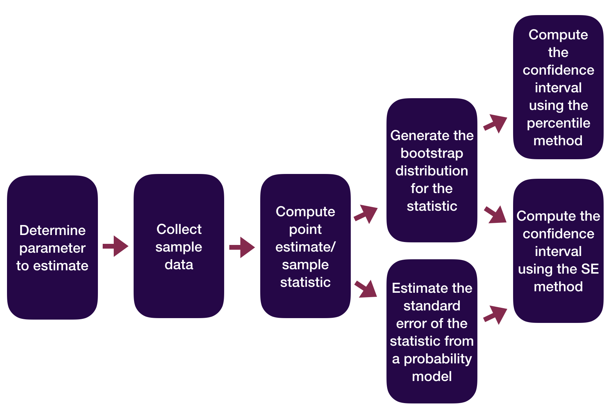

```{r}
#| include: false
#| warning: false
#| message: false
# Some global options still not available in quarto
 knitr::opts_chunk$set(fig.align = 'center')
library(knitr)
library(tidyverse)
theme_update(text = element_text(size = 16))
```

------------------------------------------------------------------------

::: columns
::: {.column .center width="45%"}
{width="90%"}
:::

::: {.column .center width="55%"}
[Inference: Random Variables + P-Value Pitfalls]{.custom-title}


[Kelly McConville]{.custom-subtitle}

[DATA 100 <br> Week 10 \| Spring 2026]{.custom-subtitle}
:::
:::

------------------------------------------------------------------------

## Announcements

-   Exam next week: 
    -  In-class on Wed (April 8th)
    -  Orals throughout the day on Fri (April 10th).  **In-person** this time!

### Goals for Today

::: columns
::: column
-   Statistical inference zoom out
-   Approximating inference using random variables
:::

::: column
-   A hearty p-values discussion

:::
:::

# Which Flavor of Data Scientist Are You?

------------------------------------------------------------------------

::: columns
::: column
Data Visualizer

<iframe src="https://giphy.com/embed/d31vTpVi1LAcDvdm" width="480" height="362" frameBorder="0" class="giphy-embed" allowFullScreen>

</iframe>

Data Wrangler

<iframe src="https://giphy.com/embed/DbaUtl1DcLyrdwhzGJ" width="480" height="362" frameBorder="0" class="giphy-embed" allowFullScreen>

</iframe>
:::

::: column
Model Builder

<br>

<iframe src="https://giphy.com/embed/xZsLh7B3KMMyUptD9D" width="480" height="270" frameBorder="0" class="giphy-embed" allowFullScreen>

</iframe>

Inferencer

<br>

<iframe src="https://giphy.com/embed/NS7gPxeumewkWDOIxi" width="480" height="270" frameBorder="0" class="giphy-embed" allowFullScreen>

</iframe>
:::
:::

------------------------------------------------------------------------

### Statistical Inference Zoom Out -- Estimation

{width="60%" fig-align="center"}

::: fragment
**Question**: How did folks do inference before computers?
:::

------------------------------------------------------------------------

### Statistical Inference Zoom Out -- Testing

{width="70%" fig-align="center"}

::: fragment
**Question**: How did folks do inference before computers?
:::

------------------------------------------------------------------------

### Statistical Inference Zoom Out -- Estimation

{width="60%" fig-align="center"}

**Question**: How did folks do inference before computers?

------------------------------------------------------------------------

### Statistical Inference Zoom Out -- Testing

{width="70%" fig-align="center"}

**Question**: How did folks do inference before computers?


# It is time to recast some of the sample statistics we have been exploring as random variables!

------------------------------------------------------------------------

### Sample Statistics as Random Variables


**Random variable** (RV) is a random process that **takes on numerical values**.

-  Statisticians understand the shape, center, and spread of MANY random variables.


::: fragment

Here are some of the sample statistics we've seen lately:

::: nonincremental
-   $\hat{p}$ = sample proportion of correct receiver guesses out of 329 trials


-   $\hat{p}_D - \hat{p}_Y$ = difference in sample improvement proportions between those who swam with dolphins and those who did not
:::

:::

::: fragment

Why are these all random variables?

:::

------------------------------------------------------------------------

## Approximating These Distributions {.smaller}

-   $\hat{p}$ = sample proportion of correct receiver guesses out of 329 trials

::: columns
::: column
::: fragment
We generated its Null Distribution:

```{r, echo = FALSE}
library(infer)
# Construct data frame of sample results
esp <- data.frame(guess = c(rep("correct", 106),
                            rep("incorrect", 329 - 106)))

# Generate null distribution 
set.seed(4111)
null_dist <- esp %>%
  specify(response = guess, success = "correct") %>%
  hypothesize(null = "point", p = 0.25) %>%
  generate(reps = 1000, type = "draw") %>%
  calculate(stat ="prop")

# Graph null distribution with test statistic
dat <- data.frame(x = seq(16, 36, length.out = 1000)/100) %>%
  mutate(y = dnorm(x, mean = .25, sd = sqrt(.25*.75/329)))
ggplot(null_dist, aes(x = stat, y = ..density..)) +
  geom_histogram(bins = 23) +
  xlim(.16, .36) + ylim(0, 17)
```
:::
:::

::: column
::: fragment
Which is well approximated by the distribution of a Normal random variable. 

```{r, echo = FALSE}
ggplot(null_dist, aes(x = stat, y = ..density..)) +
  geom_histogram(bins = 23)  +
  geom_line(data = dat, mapping = aes(x, y), color = "deeppink", size = 2) +
  xlim(.16, .36) + ylim(0, 17)
```
:::
:::
:::


------------------------------------------------------------------------

## Approximating These Distributions {.smaller}

-   $\hat{p}_D - \hat{p}_Y$ = difference in sample improvement proportions between those who swam with dolphins and those who did not

::: columns
::: column
::: fragment
We generated its Null Distribution:

```{r, echo = FALSE}
dolphins <- read.csv("data/Dolphins.txt", sep="")

null_dist <- dolphins %>%
  specify(improve ~ group, success = "yes") %>%
  hypothesize(null = "independence") %>%
  generate(reps = 1000, type = "permute") %>%
  calculate(stat = "diff in props", order = c("Treatment", "Control"))

# Graph null distribution with test statistic
phat1 <- 10/15
phat2 <- 3/15
dat <- data.frame(x = seq(-65, 65, length.out = 1000)/100) %>%
  mutate(y = dnorm(x, mean = 0, sd = sqrt(phat1*(1-phat1)/15 + phat2*(1-phat2)/15)))
ggplot(null_dist, aes(x = stat, y = ..density..)) +
  geom_histogram(bins = 23) +
  xlim(-.5, .5) + ylim(0, 7)
```
:::
:::

::: column
::: fragment
Which is **kinda somewhat** approximated by the distribution of a Normal random variable.

```{r, echo = FALSE}
ggplot(null_dist, aes(x = stat, y = ..density..)) +
  geom_histogram(bins = 23)  +
  geom_line(data = dat, mapping = aes(x, y), color = "deeppink", size = 2) +
  xlim(-.5, .5) + ylim(0, 7)
```
:::
:::
:::


# *"All models are wrong but some are useful."* -- George Box


------------------------------------------------------------------------

## Approximating These Distributions

-   How do I know **which** random variable is a good approximation for my statistic?

-   Once I have figured out the random variable, how do I **use it** to do statistical inference?

------------------------------------------------------------------------

### Central Limit Theorem

**Central Limit Theorem (CLT):** For random samples and a large sample size $(n)$, the sampling distribution of many sample statistics is approximately normal.

**Example**: Portland Park Trees

```{r, echo = FALSE, fig.asp = 0.3 }
library(tidyverse)
library(pdxTrees)
library(infer)
park_trees <- get_pdxTrees_parks()
park_trees <- park_trees %>%
  mutate(Douglas_Fir = case_when(
    Common_Name == "Douglas-Fir" ~ "yes",
    Common_Name != "Douglas-Fir" ~ "no"
  ))

# Population distribution
p1 <- ggplot(data = park_trees, mapping = aes(x = Douglas_Fir)) +
  geom_bar(aes(y = ..prop.., group = 1), stat = "count")  +
  labs(title = "The Population\n Distribution")

# Construct the sampling distribution
samp_dist <- park_trees %>% 
  rep_sample_n(size = 50, reps = 1000) %>%
  group_by(replicate) %>%
  summarize(statistic = mean(Douglas_Fir == "yes"))

# Theoretical Distribution
dat <- data.frame(x = seq(1, 50, length.out = 1000)/100) %>%
  mutate(y = dnorm(x, mean = 0.266, sd = sqrt(0.266*(1 - 0.266)/50)))

# Graph the sampling distribution
p2 <- ggplot(data = samp_dist) + geom_blank() + theme_minimal()

library(cowplot)
plot_grid(p1, p2)
```

------------------------------------------------------------------------

### Approximating Sampling Distributions

**Central Limit Theorem (CLT):** For random samples and a large sample size $(n)$, the sampling distribution of many sample statistics is approximately normal.

**Example**: Harvard Trees

```{r, echo = FALSE, fig.asp = 0.3 }
# Graph the sampling distribution
p2 <- ggplot(data = samp_dist, mapping = , aes(x = statistic, y = ..density..)) +
  geom_histogram(bins = 16) +
  geom_line(data = dat, mapping = aes(x, y), color = "deeppink", size = 2) + labs(title = "The Sampling\n Distribution")

library(cowplot)
plot_grid(p1, p2)
```

* The larger the sample size, the closer the distribution gets to being bell-shaped and symmetric, like a Normal random variable.

# Sometimes it is easier to find a good random variable approximation if we **standardize** our sample statistic first.

-----

### Z-scores

-   All of our **test statistics** so far have been **sample statistics**.

-   Another commonly used test statistic takes the form of a **z-score**:

::: fragment
$$
\mbox{Z-score} = \frac{X - \mbox{mean}}{\mbox{standard deviation}}
$$
:::

-   Standardized version of the sample statistic.

-   Z-score measures how many **standard deviations** the sample statistic is away from its **mean**.

------------------------------------------------------------------------

### Z-score Example

-   $\hat{p}$ = proportion of Maples in a sample of 50 trees

- Mean of $\hat{p}$: 0.138
- Standard deviation of $\hat{p}$: 0.049


-   Suppose we have a sample where $\hat{p} = 0.05$. Then the z-score would be:

::: fragment
$$
\mbox{Z-score} = \frac{0.05 - 0.138}{0.049} = -1.8
$$
:::

------------------------------------------------------------------------

### Z-score Test Statistics

-   A Z-score test statistic is one where we take our original sample statistic and convert it to a Z-score:

::: fragment
$$
\mbox{Z-score} = \frac{\mbox{statistic} - \mbox{mean}}{\mbox{standard deviation}}
$$
:::

-   Allows us to quickly (but roughly) classify results as unusual or not.
    -   $|$ Z-score $|$ \> 2 → results are unusual/p-value will be smallish

---

### Inference based on Random Variable Approximation: One Proportion

Let's consider conducting a hypothesis test for a single proportion: $p$

**Example**: Bern and Honorton's (1994) extrasensory perception (ESP) studies

```{r}
# Construct data frame of sample results
esp <- data.frame(guess = c(rep("correct", 106), rep("incorrect", 329 - 106)))
```

::: fragment

```{r}
# Theory-based approximation
prop_test(esp, response = guess, success = "correct", p = 0.25,
          z = TRUE, alternative = "greater")

```

:::

::: fragment

```{r}
# Confidence interval
prop_test(esp, response = guess, success = "correct", 
          conf_int = TRUE, conf_level = 0.95)
```

When is the random variable approximation reasonable?

:::

------------------------------------------------------------------------

### Inference for a Single Mean

**Example:** *Are lakes in Florida more acidic or alkaline?* The pH of a liquid is the measure of its acidity or alkalinity where pure water has a pH of 7, a pH greater than 7 is alkaline and a pH less than 7 is acidic. The following dataset contains observations on a sample of 53 lakes in Florida.

```{r}
library(tidyverse)
FloridaLakes <- read_csv("https://www.lock5stat.com/datasets1e/FloridaLakes.csv")
```

**Cases**:

**Variable of interest**:

<br>

**Parameter of interest:**

**Hypotheses:**

<br>

---

### Inference for a Single Mean: Simulation-Based Approach

::: columns
::: column
```{r}
library(infer)

#Compute obs stat
xbar <- FloridaLakes %>%
  specify(response = pH) %>%
  hypothesize(null = "point", mu = 7) %>%  
  calculate(stat = "mean")
xbar
```
:::

::: column
```{r}
# Generate null distribution
null_dist <- FloridaLakes %>%
 specify(response = pH) %>%
 hypothesize(null = "point", mu = 7) %>%
 generate(reps = 1000, type = "bootstrap") %>%
 calculate(stat = "mean")

pvalue <- null_dist %>%
  get_p_value(obs_stat = xbar,
              direction = "both")
pvalue

```
:::
:::

**Why are we using `type = "bootstrap"` when constructing a null distribution?!**

-----


### Inference for a Single Mean: Random Variable-Based Approach

```{r}
t_test(FloridaLakes, response = pH, mu = 7,
       alternative = "two-sided")
```


When is the random variable approximation reasonable?

---

### Statistical Inference using Random Variables

-   We went through random variable-based inference for $p$ and for $\mu$.

-   There are similar results for other parameters. But the random variable approximation changes.

    -   Will extend beyond inference for 1 variable next time.


# P-Values


------------------------------------------------------------------------

### Let's Talk About P-values

-   The original intention of the p-value was as an **informal** measure to judge whether or not a researcher should take a second look.

-   But to create simple statistical manuals for practitioners, this informal measure quickly became a rule: **"p-value \< 0.05" = "statistically significant"**.

::: fragment
**What were/are the consequences of the "p-value \< 0.05" = "statistically significant" rule?**
:::

------------------------------------------------------------------------

### Let's Talk About P-values

::: nonincremental
-   **A consequence**: The p-value is often misinterpreted to be the probability the null hypothesis is true.
    -   A p-value of 0.003 does not mean there's a 0.3% chance that ESP doesn't exist!
    -   By giving people a simple rule, they never learned what the p-value actually measures.
:::

------------------------------------------------------------------------

### Let's Talk About P-values

::: columns
::: column
::: nonincremental
-   **A consequence**: Researchers often put too much weight on the p-value and not enough weight on their domain knowledge/the plausibility of their conjecture.
    -   Sometimes we give more weight to things we don't understand.
-   [xkcd comic](https://xkcd.com/1132/)
:::
:::

::: column
```{r  out.width = "65%", echo=FALSE, fig.align='center'}
include_graphics("img/frequentists_vs_bayesians_2x.png") 
```
:::
:::

------------------------------------------------------------------------

### Let's Talk About P-values

::: columns
::: {.column width="65%"}
::: nonincremental
-   **A consequence**: [P-hacking](https://projects.fivethirtyeight.com/p-hacking/): Cherry-picking promising findings that are beyond this arbitrary threshold.

-   [xkcd comic](https://www.explainxkcd.com/wiki/index.php/882:_Significant)
:::
:::

::: {.column .center width="35%"}
```{r  out.width = "40%", echo=FALSE, fig.align='center'}
include_graphics("img/significant.png") 
```
:::
:::

------------------------------------------------------------------------

### Let's Talk About P-values

-   **A consequence**: People conflate *statistical significance* with *practical significance*.

::: fragment
**Example**: A recent *Nature* study of 19,000+ people found that those who meet their spouses online...
:::

-   Are less likely to divorce (p-value \< 0.002)

-   Are more likely to have high marital satisfaction (p-value \< 0.001)

-   BUT the estimated **effect sizes** were tiny.

    -   Divorce rate of 5.96% for those who met online versus 7.67% for those who met in-person.
    -   On a 7 point scale, happiness value of 5.64 for those who met online versus 5.48 for those who met in-person.

::: fragment
**Question**: Do these results provide compelling evidence that one should change their dating behavior?
:::

------------------------------------------------------------------------

### Let's Talk About P-values

::: nonincremental
-   **A consequence**: People conflate *statistical significance* with *practical significance*.

-   We won't use the **"statistically significant"** language in DATA 100. Instead say **"statistically discernible."**
:::

----

### Let's Talk About P-values

-   Despite its issues, p-values are still quite popular and can still be a useful tool **when used properly**.

-   In 2014, George Cobb a professor from Mount Holyoke College poised the following questions (and answers):

::: fragment
```{r  out.width = "55%", echo=FALSE, fig.align='center'}
include_graphics("img/Cobb.png") 
```
:::

-   I want us to stop this cycle.

------------------------------------------------------------------------

### DATA 100 & P-Values

-   Understanding p-values and being able to **interpret a p-value in context** is a learning objective of DATA 100.

    -   Ex: If ESP doesn't exist, the probability of guessing correctly on at least 106 out of 329 trials is 0.003.

-   Understanding that a small p-value means we have evidence for $H_a$ is important.

    -   Ex: Because the p-value is small, we have evidence for ESP.

-   Understanding that a small p-value alone does not imply practical significance.

    -   Create a confidence interval to measure the effect size!

-   Understanding that what you mean by **small** should depend on your field and whether a Type I Error or Type II Error is worse for **your particular research question**.

-   Your ability to tell if a \# is less than 0.05 is not a learning objective for DATA 100.


---------------------------------------------------------------------

## Reminders:

::: nonincremental
-   Exam next week: 
    -  In-class on Wed (April 8th)
    -  Orals throughout the day on Fri (April 10th).  **In-person** this time!
:::
