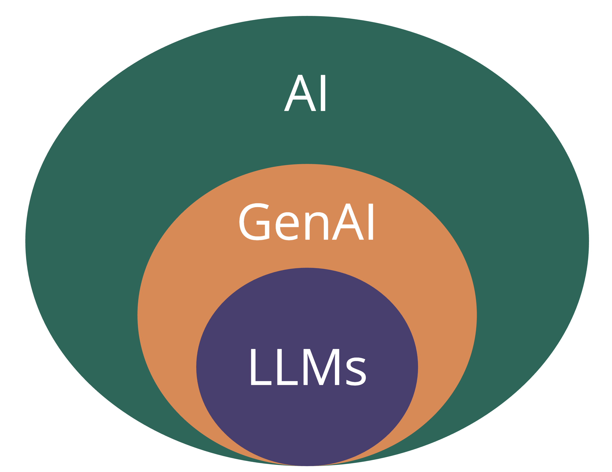
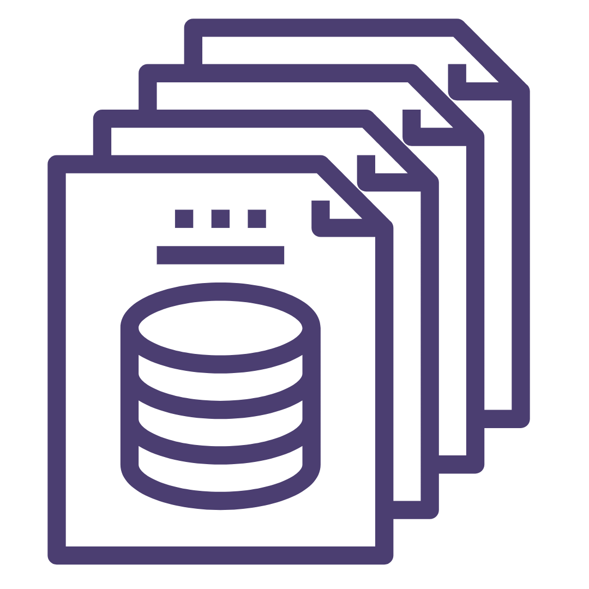
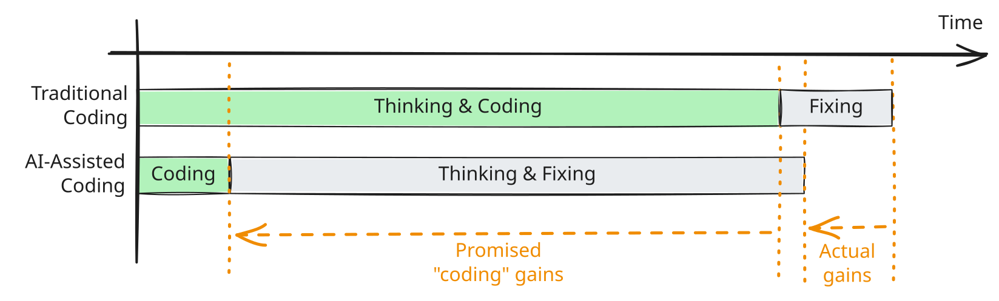

```{r}
#| include: false
#| warning: false
#| message: false
# Some global options still not available in quarto
 knitr::opts_chunk$set(fig.align = 'center')
library(knitr)
library(tidyverse)
theme_update(text = element_text(size = 13))
```

##  {#keyword .center data-menu-title="Keyword"}

::: {style="margin-top: 80px; font-size: 2em; color: #19647E;"}
Before we get started...
:::

::: {style="margin-top: 80px; font-size: 1.2em; color: #19647E;"}
Go to [burl.live/stat](https://burl.live/stat) to provide the words or phrases you think of when you hear ["statistical thinking."]{.mauve}
:::

------------------------------------------------------------------------

::::: columns
::: {.column .center width="45%"}
{width="90%"}
:::

::: {.column .center width="55%"}
[AI and Data Work]{.custom-title}

<br> <br> <br>

[Kelly McConville]{.custom-subtitle}

[DATA 100 <br> Week 14 \| Spring 2026]{.custom-subtitle}
:::
:::::

------------------------------------------------------------------------

## Announcements

-   Oral exam sign-ups will be released right after class on Slack
-   **Extra Credit Lecture Quiz**: Due In-Person at 3pm (start of lab) on Friday, May 1st
-   **Exam Rewrites**: Due on Gradescope at noon on Monday, March 4th

### Goals for Today

::::: columns
::: column
-   Statistical thinking
-   Revisit course learning objectives
:::

::: column
-   AI and data work
:::
:::::

------------------------------------------------------------------------

# What have we learned in DATA 100?

------------------------------------------------------------------------

#### (Some of the) Course Learning Objectives

::::: columns
::: {.column .center width="45%"}
{width="90%"}
:::

::: {.column width="55%"}
-   Learn how to **analyze** data in `R`.

-   Master **creating** graphs with `ggplot2`.

-   Apply data wrangling operations with `dplyr`.

-   Translate a research problem into a set of relevant questions that can be answered with data.

-   Reflect on how **sample design structures** impact potential conclusions.

-   Appropriately apply and draw inferences from a statistical model, including **quantifying and interpreting the uncertainty** in model estimates.

-   Develop a **reproducible** workflow using `R` Quarto documents.
:::
:::::

# This class has focused on developing our data skills. Now let's shift our focus to AI's impact on data work.

------------------------------------------------------------------------

## Terms, Terms, Terms

::::: columns
::: {.column .center width="50%"}
{width="80%"}
:::

::: {.column width="50%"}
-   **AI** = artificial intelligence

    -   Models that try to predict outcomes.

-   **GenAI** = AI models that produce text, images, and videos in response to prompts.

-   **LLMs** = large language models

    -   Can produce text that is very similar to human written text.
:::
:::::

------------------------------------------------------------------------

## How are LLMs so good at producing human-like text?

:::::: columns
::: {.column .center width="50%"}
{width="80%"}

-   Use neural networks, a very flexible type of AI model.
:::

:::: {.column .center width="50%"}
::: fragment
{width="80%"}
:::

-   Built on very, very large datasets.
    -   Think "the internet".
::::
::::::

------------------------------------------------------------------------

## AI and the Classroom

::::: columns
::: {.column width="80%"}
> "AI promises compelling benefits—such as saving time in busy lives and helping your work to appear more creative or clever—but there are many important but invisible tradeoffs in using it, especially in the classroom. Therefore, at least in school, **there’s good reason not to use or rely on AI/LLMs while you’re still learning new skills and growing as a person**, even if it’s ok to use it in future jobs where producing work is more important than learning." -- Patrick Lin, Philosophy Professor at Cal Poly
:::

::: {.column .center width="20%"}
<br>


:::
:::::

------------------------------------------------------------------------

## Fluency isn't Truth

-   Output from AI models sounds human-like.

-   People often believe it is true.

    -   The model is just a predictive engine.

-   Lots of examples of hallucinations!

    -   Citations
    -   Medical dosages
    -   Code

-   Need to always have a human verify output!

------------------------------------------------------------------------

## Ethical use of GenAI

-   You evaluate the relevance, usefulness, and accuracy of GenAI outputs.

-   You understand the potential harms of GenAI.

    -   On the environment (e.g., data centers)
    -   On the labor market (especially entry-level jobs).
    -   On society (eg., facial recognition software, revenge porn, deepfakes).

-   You examine the privacy and data security risks of GenAI.

-   You credit GenAI contributions in your work through appropriate citations.

------------------------------------------------------------------------

## Developing your Data & AI Literacy at Bucknell

-   About developing **reasoning**

    -   Not just learning definitions and formulae
    -   Not just memorizing arbitrary rules (p-value $<$ 0.05, sample size $>$ 30)
    -   Consider the appropriateness of AI for the task at hand.

-   Requires **judgment** that takes time to develop

    -   Consider taking DATA 101: Foundations of AI!


# How is AI impacting data work?

-------


## Building new tools

::::: columns


::: {.column .center width="75%"}

* Simon Couch was one of my former Reed students.

* He has created `R` packages to support data analysis.

* Starting in late 2024, shifted focus to `R` packages that allow data scientists to engage with LLMs in `R`.  

* There is demand for people who like to program and want to experiment with ways to leverage LLMs for data work!

:::

::: {.column .center width="25%"}
{width="90%"}
:::

:::::


------------------------------------------------------------------------

## Vibe coding

-   Vibe coding is where an AI tool generates code based on prompts from a person.
-   Important skills to develop:
    -   Ability to review and debug the AI generated code.
    -   Ability to prompt the AI tool for better code.
    -   A strong understanding of what you want the AI code to produce.
        -   Don't let it take you down the wrong rabbit hole.
    -   Taste! Don't produce AI slop (i.e., generic, vanilla graphs).

------------------------------------------------------------------------

## Vibe coding

The new paradigm of coding work:



From ["The AI Coding Trap" by Chris Loy](https://chrisloy.dev/post/2025/09/28/the-ai-coding-trap)

------------------------------------------------------------------------

## AI-Driven Engineering

Loy defines two different types of coding with AI tools:

> "AI-driven engineering: employing best practices, foregrounding human understanding of the code, moving slowly to make development sustainable."

> "Vibe coding: throwing caution to the wind and implementing at speed, sacrificing understanding for delivery velocity, hitting an eventual wall of unsalvageable, messy code."


Note: We will still use the more common term of "vibe coding" but will advocate for "vibe coding + human review + iteration".

------------------------------------------------------------------------

## Setting up pipelines for engaging with LLMs in a structured way and using the model output

-   The `ellmer` package is great for this!
-   Asking LLMs to output responses into a dataframe so they are easier to analyze.
-   Important skills to develop:
    -   Ability to evaluate the AI output.
    -   Ability to engage with an LLM in `R` and not just via chatbots.

------------------------------------------------------------------------

## Increasing efficiency by incorporating AI into time-intensive steps of the research process.

-   Example:
    -   Detecting dance movements in children
-   Important skills to develop:
    -   Understanding what steps AI can actually speed up.
    -   Comparing the AI output to the human output.

# Activity: Let's experiment by vibe coding with Gemini. Open the Vibe Coding project in Posit Cloud.
