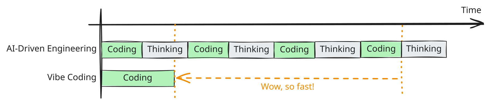
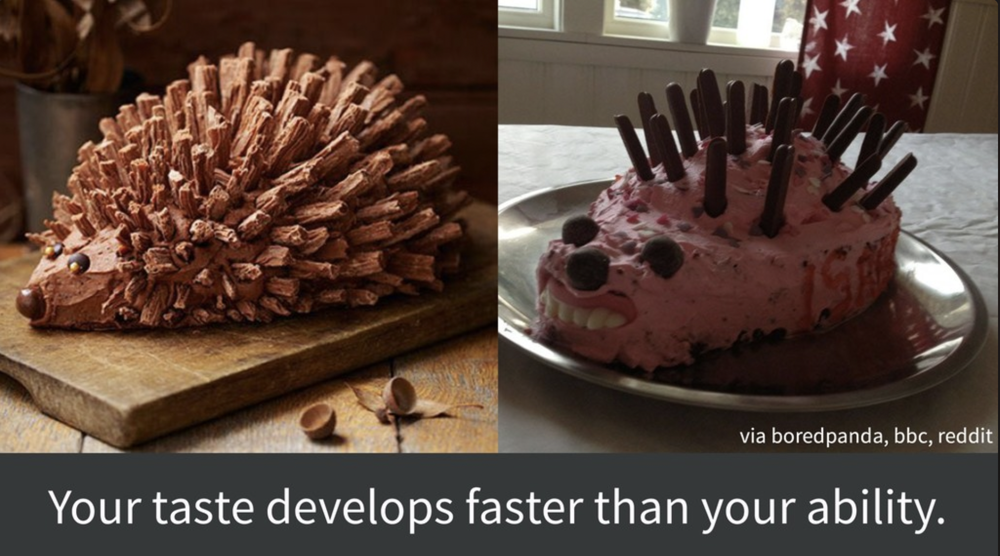
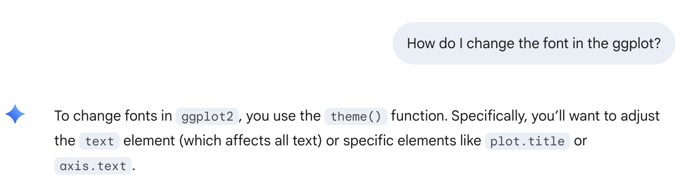
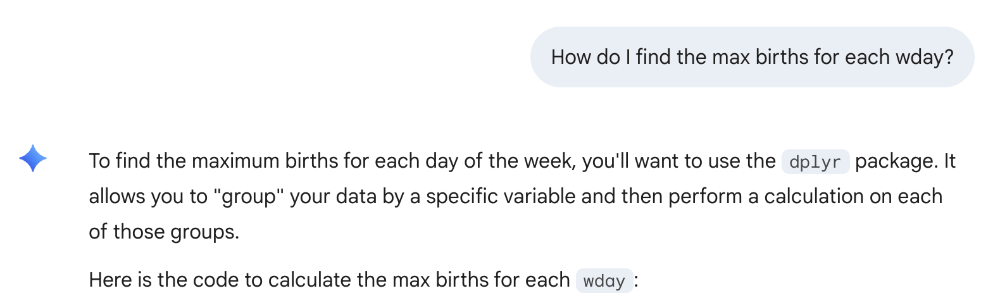
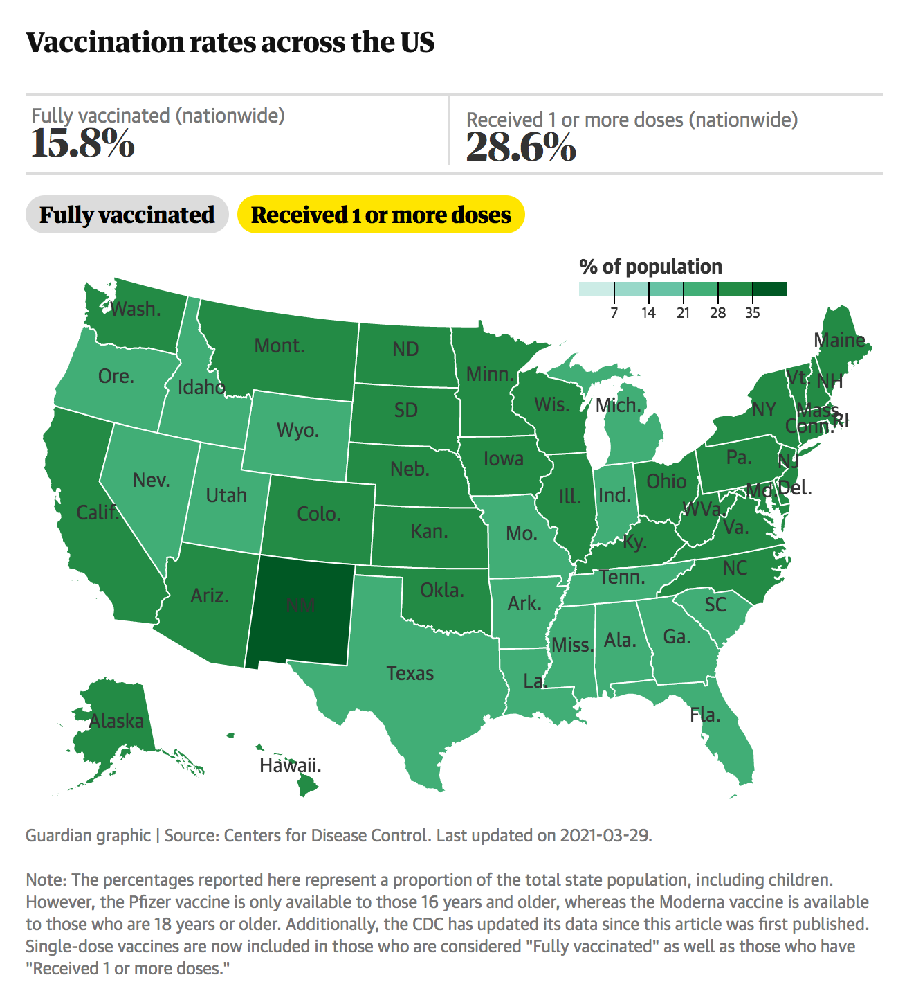

```{r}
#| include: false
#| warning: false
#| message: false
# Some global options still not available in quarto
 knitr::opts_chunk$set(fig.align = 'center')
library(knitr)
library(tidyverse)
theme_update(text = element_text(size = 20))
```


::::: columns
::: {.column .center width="45%"}
{width="90%"}
:::

::: {.column .center width="55%"}
[Developing Coding Taste]{.custom-title}

<br> <br> <br>

[Kelly McConville]{.custom-subtitle}

[DATA 100 <br> Week 14 \| Spring 2026]{.custom-subtitle}
:::
:::::

------------------------------------------------------------------------

## Announcements

-   Oral exam sign-ups in Slack
-   **Extra Credit Lecture Quiz**: Due In-Person at 3pm (start of lab) on Friday, May 1st
-   **Exam Rewrites**: Due on Gradescope at noon on Monday, March 4th

### Goals for Today

::::: columns
::: column
-   Developing Coding Taste
-   Code smells
:::

::: column
-   Learning a new coding task: maps!
:::
:::::

---

## Recap: Vibe coding

-   Vibe coding is where an AI tool generates code based on prompts from a person.
-   Important skills to develop:
    -   Ability to review and debug the AI generated code.
    -   Ability to prompt the AI tool for better code.
    -   A strong understanding of what you want the AI code to produce.
        -   Don't let it take you down the wrong rabbit hole.
    -   **Taste!** 

------------------------------------------------------------------------


## AI-Driven Engineering

Think first and often when coding with AI!

> "AI-driven engineering: employing best practices, foregrounding human understanding of the code, moving slowly to make development sustainable."

> "Vibe coding: throwing caution to the wind and implementing at speed, sacrificing understanding for delivery velocity, hitting an eventual wall of unsalvageable, messy code."



---

## Developing Your Taste for Well Constructed Code


* Want code that:
    * Works.
    * Is robust.
    * Is easy to understand.
    * Is easy to contribute to.

* **Code smells**:  Structures in code that violate at least one of the items above.

---

## Example: Bike Counter

::: nonincremental

* Let's return to the Cambridge bike counter data.

* Import the [data](https://data.cambridgema.gov/Transportation-Planning/Eco-Totem-Broadway-Bicycle-Count/q8v9-mcfg).

:::

```{r}

july_2019 <- read_csv("data/july_2019.csv")

# Inspect the data
glimpse(july_2019)
```

* Suppose we didn't have the `Total` column and wanted to create it by adding `Westbound` and `Eastbound`.

---

## Smelly Code


::::: columns
::: {.column width="50%"}

**Smelly Code**

```{r}
july_2019$new_T=rep(5, 192)
for(i in 1:129){
  july_2019$new_T[i]=july_2019[i,6]+july_2019[i,7]
}

```
:::


::: {.column width="50%"}

**Not Smelly Code**

```{r}
july_2019 <- mutate(july_2019, 
                    new_Total = Westbound + Eastbound)
```
:::

:::::

::: fragment

Both are correct-ish:

```{r}
glimpse(july_2019)
```

But why is the lefthand code smelly?

:::

---

## Developing Your Taste for Well Constructed Outputs


* Want outputs that are:
    * Accurate.
    * Clear.
    * Unique.
    * Provide context.

* Let's look at some of the final graphs from last class and ask:
    * Which graph do you prefer?  
    * How could the graphs be improved?

---

## Example: Birth Patterns in the US

::::: columns
::: {.column width="20%"}
:::

::: {.column width="60%"}


```{r}
#| echo: false

# Load ggrepel to help with labeling points
library(ggrepel)

# Load package that will graph emojis
library(emoGG)

# Load library that has dataset of interest
library(mosaicData)

# Grab data
data(Births2015)
```


```{r}
#| echo: false
holidays <- 
  data.frame(date = ymd("2015-01-01","2015-05-25", "2015-07-04",
                        "2015-12-25", "2015-11-26", "2015-12-24",
                        "2015-09-07"), 
            occasion = c("New Year", "Memorial Day", 
                         "Independence Day", "Christmas",
                         "Thanksgiving", "Christmas Eve", 
                         "Labor Day"),
            emoji = c("1f389", "1f396", "1f386", "1f384", 
                      "1f983", "1f381", "1f477"))
holidays <- left_join(holidays, Births2015) 


ggplot(data = Births2015,
       mapping = aes(x = date, y = births,
                     color = wday)) +
  geom_point(size = 4, alpha = 0.7) +
  scale_color_brewer(type = "qual", palette = 2) +
  scale_x_date(date_labels = "%b",
               date_breaks = "2 month") +
  theme_gray(base_size = 15)  + 
  theme(legend.position = "bottom")  + 
   labs(x = "Date",
        y = "Daily Birth Counts", 
        subtitle = "US Birth Counts in 2015", 
        title = "Birth Patterns on Holidays Mimic the Weekend",
        caption = "Data: National Vital Statistics System", 
        color = "Day of Week") + 
  geom_label_repel(data = holidays,
            mapping = aes(label = occasion), size = 6,
            show.legend = FALSE) 

```

:::

::: {.column width="20%"}

:::

:::::


---

## Example: Birth Patterns in the US

::::: columns
::: {.column width="20%"}
:::

::: {.column width="60%"}


```{r}
#| echo: false

# Load ggrepel to help with labeling points
library(ggrepel)

# Load package that will graph emojis
library(emoGG)

# Load library that has dataset of interest
library(mosaicData)

# Grab data
data(Births2015)
```


```{r}
#| echo: false
holidays <- 
  data.frame(date = ymd("2015-01-01","2015-05-25", "2015-07-04",
                        "2015-12-25", "2015-11-26", "2015-12-24",
                        "2015-09-07"), 
            occasion = c("New Year", "Memorial Day", 
                         "Independence Day", "Christmas",
                         "Thanksgiving", "Christmas Eve", 
                         "Labor Day"),
            emoji = c("1f389", "1f396", "1f386", "1f384", 
                      "1f983", "1f381", "1f477"))
holidays <- left_join(holidays, Births2015) 


ggplot(data = Births2015,
       mapping = aes(x = date, y = births,
                     color = wday)) +
  geom_point(size = 4, alpha = 0.7) +
  scale_color_brewer(type = "qual", palette = 2) +
  scale_x_date(date_labels = "%b",
               date_breaks = "2 month") +
  theme_gray(base_size = 15)  + 
  theme(legend.position = "bottom")  + 
   labs(x = "Date",
        y = "Daily Birth Counts", 
        subtitle = "US Birth Counts in 2015", 
        title = "Birth Patterns on Holidays Mimic the Weekend",
        caption = "Data: National Vital Statistics System", 
        color = "Day of Week") + 
  annotate("segment", colour = "black",
           x = as_date("2015-09-01"), 
           xend = holidays$date,
           y = 6800, yend = holidays$births, 
           linewidth = 1, alpha = 0.2, arrow = arrow())+ 
  annotate("text", x = as_date("2015-09-01"),
           y = 7500, label = "Holidays",
           color="black", size=5)

```

:::

::: {.column width="20%"}

:::

:::::


---

## Example: Birth Patterns in the US

::::: columns
::: {.column width="20%"}
:::

::: {.column width="60%"}


```{r}
#| echo: false

# Load ggrepel to help with labeling points
library(ggrepel)

# Load package that will graph emojis
library(emoGG)

# Load library that has dataset of interest
library(mosaicData)

# Grab data
data(Births2015)
```


```{r}
#| echo: false
holidays <- 
  data.frame(date = ymd("2015-01-01","2015-05-25", "2015-07-04",
                        "2015-12-25", "2015-11-26", "2015-12-24",
                        "2015-09-07"), 
            occasion = c("New Year", "Memorial Day", 
                         "Independence Day", "Christmas",
                         "Thanksgiving", "Christmas Eve", 
                         "Labor Day"),
            emoji = c("1f389", "1f396", "1f386", "1f384", 
                      "1f983", "1f381", "1f477"))
holidays <- left_join(holidays, Births2015) 


ggplot(data = Births2015,
       mapping = aes(x = date, y = births,
                     color = wday)) +
  geom_point(size = 4, alpha = 0.7) +
  scale_color_brewer(type = "qual", palette = 2) +
  scale_x_date(date_labels = "%b",
               date_breaks = "2 month") +
  theme_gray(base_size = 15)  + 
  theme(legend.position = "bottom")  + 
   labs(x = "Date",
        y = "Daily Birth Counts", 
        subtitle = "US Birth Counts in 2015", 
        title = "Birth Patterns on Holidays Mimic the Weekend",
        caption = "Data: National Vital Statistics System", 
        color = "Day of Week") + 
  geom_emoji(data = holidays,
             mapping = aes(emoji = emoji, 
                           x = date,
                           y = births),
             inherit.aes = FALSE)

```

:::

::: {.column width="20%"}

:::

:::::

---

## Learn from Experts & AI

* [Jenny Bryan](https://github.com/jennybc) is a rock star coder.  Reading her materials and watching her presentations has made me a better coder.

* Jenny's observation:

:::fragment

```{r, echo = FALSE, out.width= '40%'}

```

:::

* But AI can help speed up your ability by helping you learn new code.  
    + As long as you keep **developing your own taste.**
    

---

## Suggestions for Developing Taste while Vibe Coding

* Know what you want.

:::fragment

```{r, echo = FALSE, out.width= '50%'}

```

:::

* And then **iterate**.

---

## Suggestions for Developing Taste while Vibe Coding

* Be curious.
    + Saw lots of great curiosity on Monday!
    
:::fragment

```{r, echo = FALSE, out.width= '40%'}

```

:::

:::fragment

```{r, echo = FALSE, out.width= '40%'}

```

:::
    
    
---

## Suggestions for Developing Taste while Vibe Coding

* Keep code concise and consistent.
    + Ex: Don't load packages at the start of every chunk!

:::fragment    
    
```{r}
library(dplyr)
library(ggplot2)
```

:::

---

## Suggestions for Developing Taste while Vibe Coding


Don't over-comment your code.

```{r}
#| eval: false

# Create the plot with a qualitative ColorBrewer palette
ggplot(data = Births2015, aes(x = date, y = births, color = wday)) +
  geom_point(alpha = 0.8, size = 1.5) +  # Added alpha and size for better visibility
  scale_color_brewer(palette = "Dark2") + # Applies the distinct qualitative palette 
  theme(
    legend.position = "bottom", # Moves legend to bottom for a wider plot area
    plot.title = element_text(face = "bold") # Bolds the title for a cleaner look
  )
```

---

##  Suggestions for Developing Taste while Vibe Coding


Be unique and don't settle for the defaults.


```{r}
#| output-location: column

Births2015 <- mutate(Births2015, when = if_else(
  day_of_week %in%c(1, 7), "Weekend", "Weekday"
))

ggplot(data = Births2015,
       mapping = aes(x = date, y = births,
                     color = when)) +
  geom_point()
```


---

##  Suggestions for Developing Taste while Vibe Coding

Avoid the illusion of context.

```{r}
#| output-location: column


ggplot(data = Births2015,
       mapping = aes(x = date, y = births,
                     color = when)) +
  geom_point() +
  labs(
    title = "US Births in 2015 by Day of the Week",
    x = "Date",
    y = "Number of Births",
    color = "Week or Weekend?"
  )
```


# Let's learn something new: Maps in `R`!

---

### Spatial Data

* Data that is linked to the physical world.

* Visualizing these data on a map (or map-like graph) is a great way to add useful context! 

* Focus on choropleth maps and raster maps.

---

### Static, Raster Maps

```{r, out.width="60%", echo=FALSE}
knitr::include_graphics("img/static_map.png")
```

Source: [JHU](https://coronavirus.jhu.edu/map.html)


---

### Choropleth Maps

```{r, out.width="40%", echo=FALSE, fig.align='center'}

```


Source: [The Guardian](https://www.theguardian.com/us-news/2021/feb/18/us-vaccine-distribution-tracker-by-state)


---

### Interactive Maps 

Can be choropleth or raster maps!

```{r, out.width="50%", echo=FALSE}
knitr::include_graphics("img/climate_change.png")
```

Source: [NYTimes](https://www.nytimes.com/2020/10/15/learning/whats-going-on-in-this-graph-climate-threats.html)

---

## Spatial Data Structures

* Often stored in special data structures
    + Ex: Shapefile(s)
    + Consist of geometric objects like points, lines,
    and polygons

* Visualizing Spatial Data
    + Need to draw the map
    + Add metadata on top of the map
        + Color in regions
        + Dots
        

# Downloading Materials from Posit Cloud        

# Let's Learn Something New: Mapping Activity in Posit Cloud


