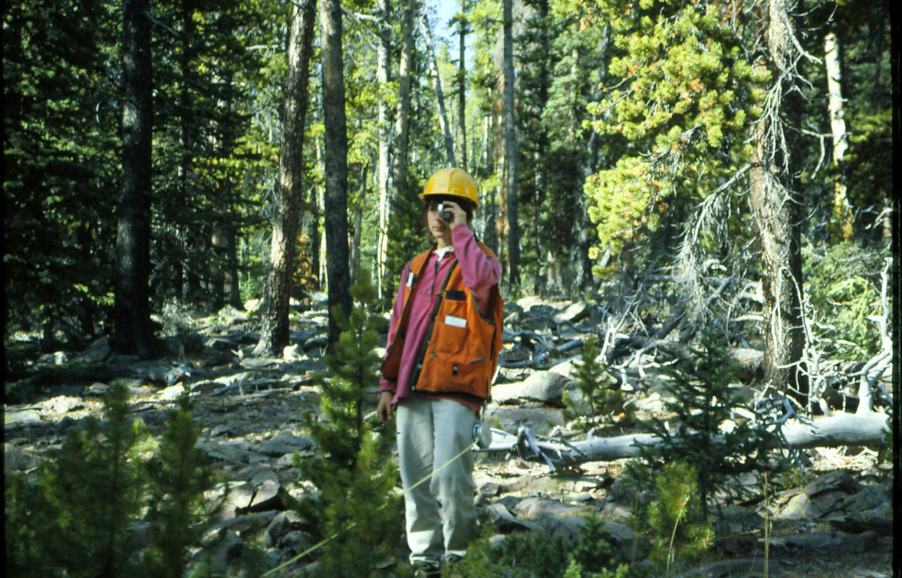
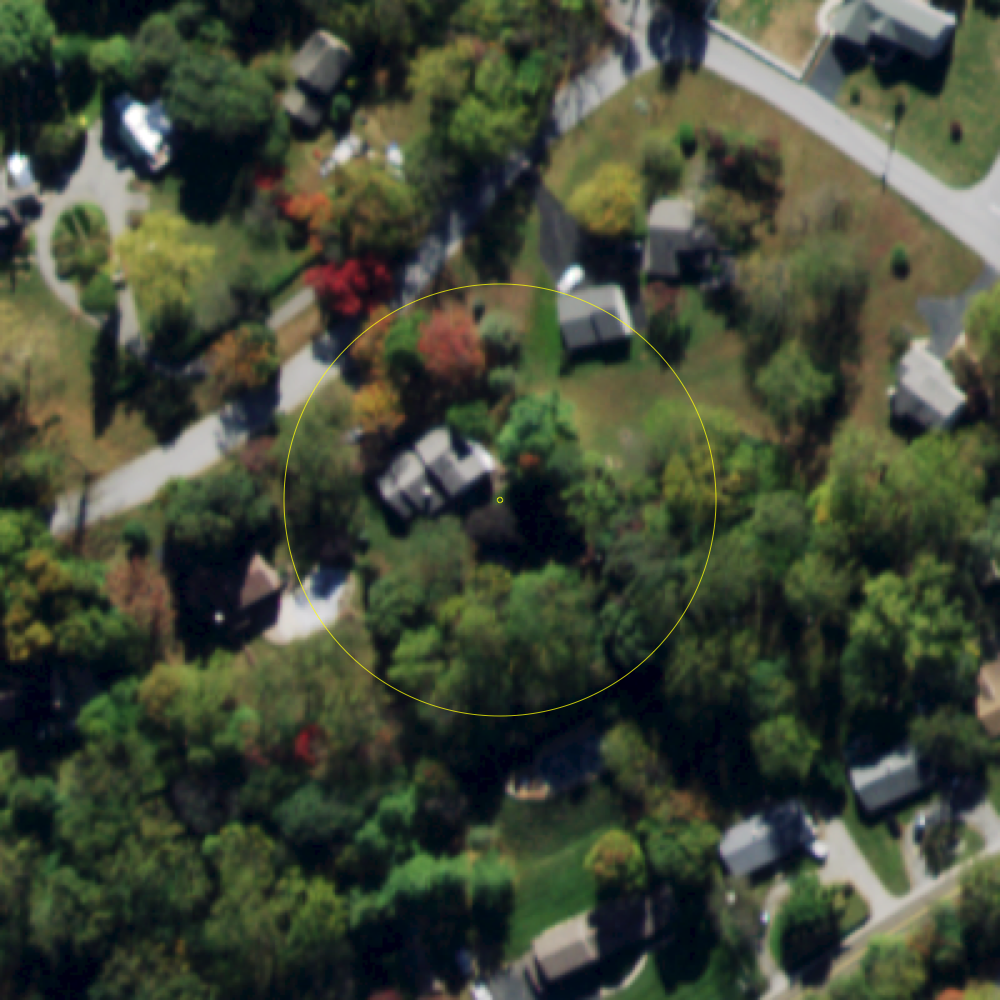
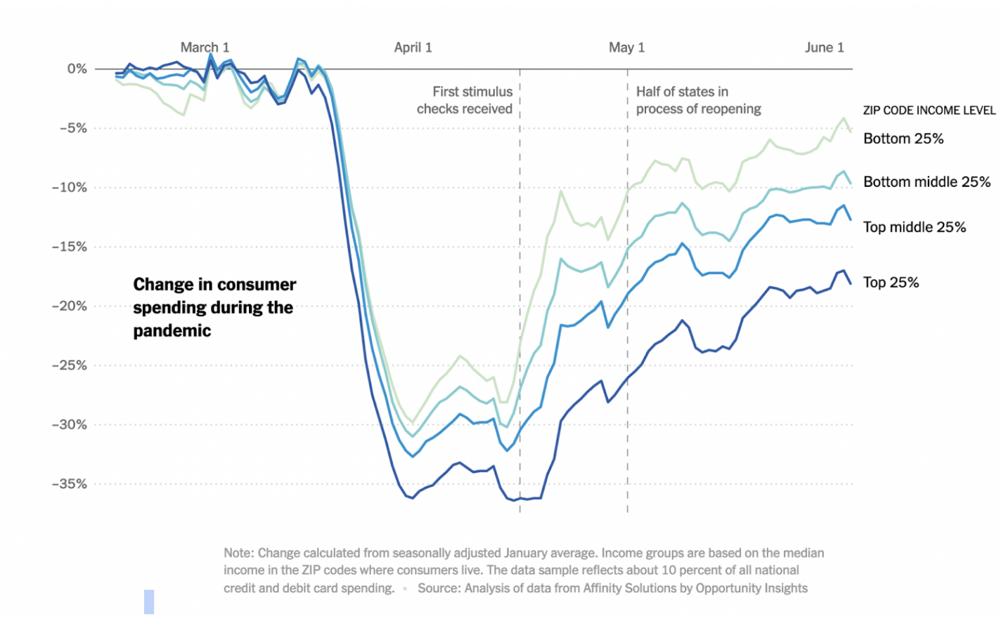

```{r}
#| include: false
#| warning: false
#| message: false
# Some global options still not available in quarto
 knitr::opts_chunk$set(fig.align = 'center')
library(knitr)
library(tidyverse)
theme_update(text = element_text(size = 20))
```

::::: columns
::: {.column .center width="45%"}
{width="90%"}
:::

::: {.column .center width="55%"}
[Last Day of DATA 100]{.custom-title}

<br> <br> <br>

[Kelly McConville]{.custom-subtitle}

[DATA 100 <br> Week 15 \| Spring 2026]{.custom-subtitle}
:::
:::::

------------------------------------------------------------------------

## Announcements

-   Oral exam on Thursday and Friday (before in-class)
-   In-class exam on Friday 3:30 - 6:30, Taylor 203

### Goals for Today

::::: columns
::: column
-   Working in a local installation of RStudio
-   AI through `ellmer`
:::

::: column

-   Practice
-   To Dos
:::
:::::

-----

## Our Impressions of Statistical Thinking...


```{r, echo = FALSE}
set.seed(4143)
library(tidyverse)
library(wordcloud)
library(viridis)
library(tidytext)
think <- read_csv("data/What is statistical thinking_ (Responses) - Sheet12026.csv") %>%
  mutate(keyword = str_to_lower(keyword, locale = "en")) %>%
  drop_na(keyword)
```

::: columns


::: column

```{r, echo = FALSE}
End <- think %>%
  filter(when == "End") %>%
  count(keyword)
End_tokenized <- think %>%
  filter(when == "End") %>%
  unnest_tokens(word, keyword)  %>%
  anti_join(stop_words) %>%
  count(word) 
End_tokenized2 <- think %>%
  filter(when == "End") %>%
  unnest_tokens(bigram, keyword)  %>%
#  anti_join(stop_words) %>%
  count(bigram) 
#Palette
pal <- viridis_pal(alpha = 1, begin = 0, end = .8, direction = 1,
                   option = "D")(10)
wordcloud(End_tokenized$word,
          End_tokenized$n, scale = c(6, 1),
          rot.per = .3,
          colors = pal, min.freq = 2)
```

:::

::: column

```{r, echo = FALSE}
Beginning <- think %>%
  filter(when == "Beginning") %>%
  count(keyword)
Beginning_tokenized <- think %>%
  filter(when == "Beginning") %>%
  unnest_tokens(word, keyword)  %>%
  anti_join(stop_words) %>%
  count(word) 
Beginning_tokenized2 <- think %>%
  filter(when == "Beginning") %>%
  unnest_tokens(bigram, keyword)  %>%
#  anti_join(stop_words) %>%
  count(bigram) 
#Palette
pal <- viridis_pal(alpha = 1, begin = 0, end = .8, direction = 1,
                   option = "D")(10)
wordcloud(Beginning_tokenized$word,
          Beginning_tokenized$n, scale = c(7, 2),
          rot.per = .3,
          colors = pal, min.freq = 3)
```

:::


:::


----

## Agentic AI

* So far we have been engaging with Gemini, a generative AI chat tool.  
    + We write a prompt and get a response.  

* Agentic AI systems go a step further and can do tasks/make decisions.  

* Companies are exploring ways to insert AI agents into their data work.

* [Cautionary tale](https://tech.yahoo.com/ai/article/this-claude-powered-ai-agent-deleted-a-companys-whole-database--and-then-gloated-about-it-165838948.html): An AI agent recently deleted PocketOS's production database and backups
    + Rental car customers couldn't access any bookings made in the last three months.
    
::: fragment

> "This isn't a story about one bad agent or one bad API. It's about an entire industry building AI-agent integrations into production infrastructure faster than it's building the safety architecture to make those integrations safe." -- Jer Crane, founder of PocketOS

:::
    


----

## Interacting with LLMs directly in `R` through `ellmer`

Borrowing lots of this discussion from [Hadley Wickham](https://hadley.nz/), Chief Scientist at Posit

```{r}
library(ellmer)

chat <- chat_claude()
chat$chat("Describe Bucknell in one word and don't say bison.")
```

* To use Claude with RStudio does cost money and requires an API key.  

* Note: There are other AI tools for RStudio that are more heavy-handed and more expensive.  


---

## LLMs are Bad at Multiplication of Big Numbers

```{r}
x <- 20598162
y <- 83106206
chat$chat(interpolate("What's {{x}} * {{y}}?"))
```

```{r}
x * y 
```


---


##  But LLMs are Improving!

A year ago, Claude was terrible at answering the following question:

```{r}
chat$chat("How many n's in unconventional?") 
```


* Now it usually gets it correct, but not always!

# How does ELLMER help with data work?

---

##  Pulling out useful information

Want to grab the name and age from the following data:

```{r}
prompts <- list(
"I go by Alex. 42 years on this planet and counting.",
"Pleased to meet you! I'm Jamal, age 27.",
"They call me Li Wei. Nineteen years young.",
"Fatima here. Just celebrated my 35th birthday last week.",
"The name's Robert - 51 years old and proud of it.",
"Kwame here - just hit the big 5-0 this year."
)
```

---

##  Pulling out useful information

```{r}
chat$chat("Extract the name and age from each sentence I give you.")
chat$chat(prompts[[1]])
chat$chat(prompts[[2]])
```

---

## And then storing the information in a data frame!

```{r}
type_person <- type_object(
name = type_string(),
age = type_number()
)

chat$chat_structured(prompts[[1]], type = type_person)
parallel_chat_structured(chat, prompts, type = type_person)
```

#  And how is this helpful?


---

## Image Detection for the Forest Inventory and Analysis Program (FIA)


::::: columns
::: {.column width="50%"}

* FIA sends field crews out to take tree measurements on plots.

* Visiting a plot is expensive.  

* Beforehand, they have someone look at an image of the location and decide if it has sufficient trees or not.  
    +  If not, they don't send a crew.

:::

::: {.column .center width="50%"}



:::

:::::

---

## Image Detection for the Forest Inventory and Analysis Program (FIA)

*  Their systematic sampling design means that there is a plot about every 6,000 acres.  

::: fragment

```{r}
chat$chat("How many acres are there in the US, excluding Alaska?")
1.9*1000000000/6000
```

:::

* That is a lot of plots to visit!

---

## Image Detection for the Forest Inventory and Analysis Program (FIA)


::::: columns
::: {.column width="50%"}

Two Bucknell students, Odilon Ligan and Jean Marie Ngabonziza, wrote some `ellmer` code to detect the landcover of images.

{width=65%}

:::

::: {.column .center width="50%"}

::: fragment

```{r}
image <- content_image_file("img/circled_image.png")

chat$chat(image, 
          "What is the landcover type in the circle?")
```

:::

:::

:::::

---

##  How To Think about LLMs and Your Data Work

LLMs:

* The results from LLMs are stochastic, meaning you can get different answers to the same prompt from the same model.
* The models are constantly changing.
* They give plausible results.
* They rarely admit doubt.
* They can produce code and outputs that are generic/lacking taste.

---

##  How To Think about LLMs and Your Data Work

-   Important skills to develop:
    -   Ability to review and debug the AI generated code.
    -   Ability to prompt the AI tool for better code.
    -   A strong understanding of what you want the AI code to produce.
        -   Don't let it take you down the wrong rabbit hole.
    -   **Taste!**

---

### Checklist of Remaining DATA 100 Items

::: columns
::: {.column width="45%"}
`r emo::ji("talk")` Sign up for an oral exam slot if you haven't already. 

`r emo::ji("question")` Come by office hours with any questions while studying for the final exam.


::: nonincremental
* Remaining Office hours:
    + Rebecca's today 4:30 - 6pm, Taylor 203
    + Kelly's Tuesday 2:30 - 3:30pm, Taylor 212
    + Kelly's Wednesday 3:00 - 4:00pm, Taylor 212
:::    


:::

::: {.column width="45%"}

`r emo::ji("tada")` Complete the oral exam on May 7th or 8th (in Taylor 210 or 212.)

`r emo::ji("bangbang")` Complete the in-class exam on May 8th 3:30 - 6:30pm in Taylor 203.

`r emo::ji("bar_chart")` Consider what other data classes to take!

`r emo::ji("evergreen_tree")` Add a calendar note to email Prof McConville on 5/4/36 to show her I still know how to interpret a p-value.
:::
:::

# Practice

----

## Deconstruct a graph

* What is the geometric shape or object?
* Identify all mappings of variables to the aesthetics of the geometric shape.
* What story is the graph telling?
* Assess the effectiveness of the graph at telling the story.

----

## Deconstruct a graph


::: columns
::: {.column width="15%"}

:::

::: {.column width="70%"}



:::

::: {.column width="15%"}

:::

:::

